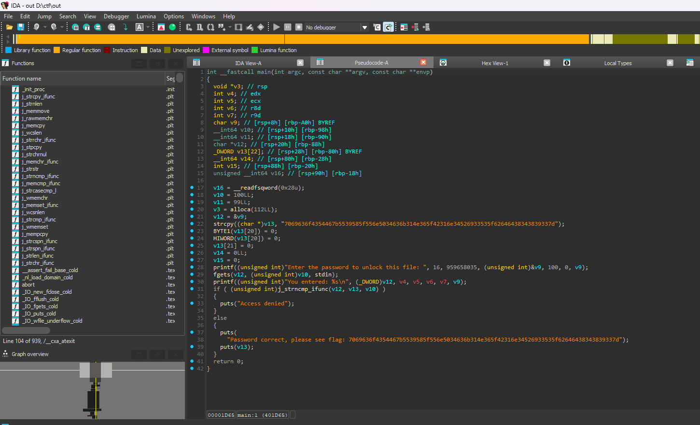

# **packer**

Description:

> Reverse this linux executable?

if we open it using IDA

we can see that there are very less functions

lets cheak for if it is packed or not 

UPX packers leave markers like UPX!, UPX0, UPX1 in the binary. Seeing that is a reliable indicator the file was packed with UPX (not just stripped).

“OK” from upx -t means UPX thinks the packed file is valid and recoverable.

lets unpack the binary

now it is unpacked lets open it in IDA

here we can see the string `7069636f4354467b5539585f556e5034636b314e365f42316e34526933535f62646438343839337d` now lets use [CyberChef](https://gchq.github.io/CyberChef/) magic to get the flag

