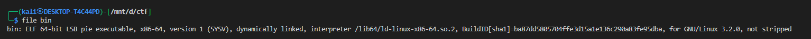
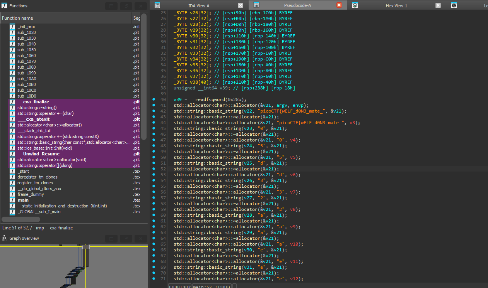

# **FactCheck**


## Description:

> This binary is putting together some important piece of information... Can you uncover that information?


This challenge was a small reverse task: the program constructs a flag at runtime from many 1-character `std::string` temporaries and some trivial conditionals.


Run `file` on the binary:




## Decompile / inspect

Open the unpacked binary in your decompiler (Ghidra / IDA). The decompiler shows a `main` that:

* Creates a `std::string` `v22` initialized to:

  ```
  "picoCTF{wELF_d0N3_mate_"
  ```

  (this is the flag prefix)

* Constructs many one-character `std::string` temporaries (`v23` .. `v38`) each initialized to single characters like `"0"`, `"5"`, `"d"`, `"3"`, `"2"`, `"a"`, `"e"`, etc.



Example constructor pattern the decompiler shows:

```cpp
std::string::basic_string(v26, "3", &v21);
```

This is simply:

```cpp
std::string v26 = "3";
```

* The code then has a sequence of `if` statements and `operator+=` calls that append some of the temporaries to `v22` (the main string). Many `if`s are trivial (always true or always false), e.g. `if ("Hello" == "World")` (false).

---

## 4) Logic walkthrough (how flag is assembled)

Key temporaries and their values:

```
v22 = "picoCTF{wELF_d0N3_mate_"   // base prefix
v23 = "0"
v24 = "5"
v25 = "d"
v26 = "3"
v27 = "2"
v28 = "a"
v29 = "a"
v30 = "e"
v31 = "e"
v32 = "d"
v33 = "b"
v34 = "e"
v35 = "6"
v36 = "c"
v37 = "9"
v38 = "8"
```

Conditionals evaluated in order (with reason):

1. `if (*(v24[0]) <= 65) append v34`

   * `v24` == `'5'` (ASCII 53) → `53 <= 65` → **true** → append `"e"` (v34)

2. `if (*(v35[0]) != 65) append v37`

   * `v35` == `'6'` (ASCII 54) → `54 != 65` → **true** → append `"9"` (v37)

3. `if ("Hello" == "World") append v25`

   * always **false**, skip.

4. `if (v26[0] - v30[0] == 3) append v26`

   * `'3'`(51) - `'e'`(101) = -50 → **false**, skip.

Then unconditional appends in order:

* append `v25` → `"d"`
* append `v28` → `"a"`  ← **this 'a' is appended**
* `if (v29[0] == 71) append v29` → `'a'` != 71 → skip
* append `v27` → `"2"`
* append `v36` → `"c"`
* append `v23` → `"0"`
* append `v31` → `"e"`
* append `125LL` → ASCII 125 == `'}'`

Putting it together after all appends:

```
picoCTF{wELF_d0N3_mate_  + e + 9 + d + a + 2 + c + 0 + e + }
=> picoCTF{wELF_d0N3_mate_e9da2c0e}
```

---

## Final flag

```
picoCTF{wELF_d0N3_mate_e9da2c0e}
```

---

