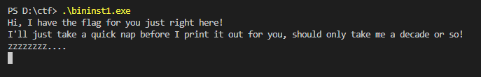
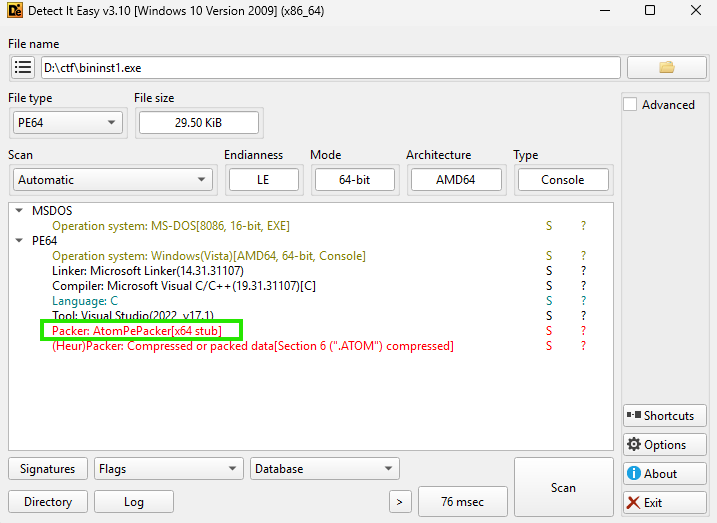
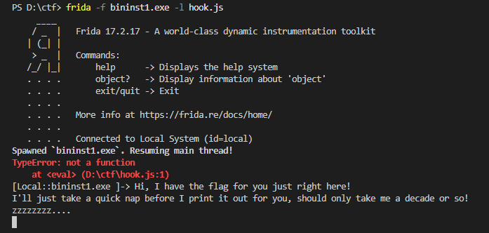
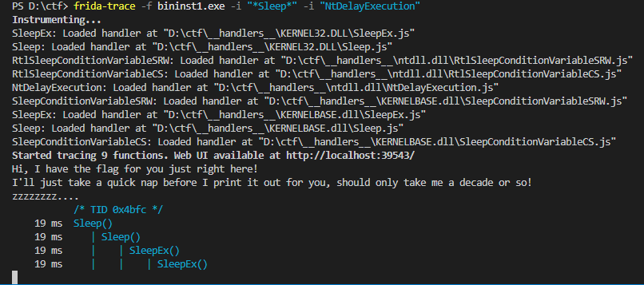
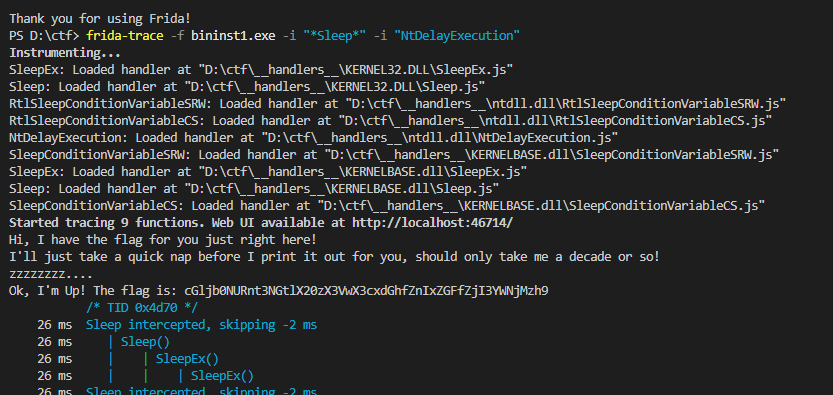
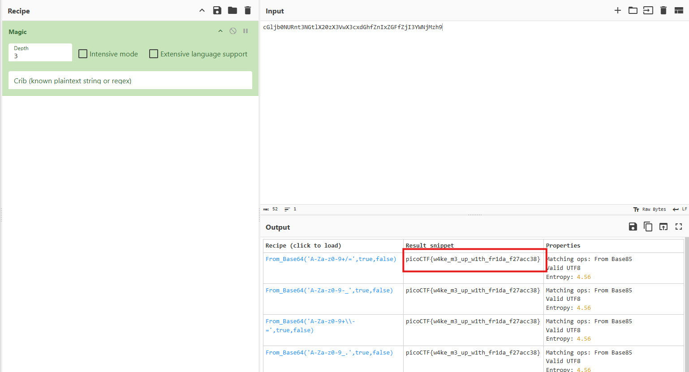

# Binary Instrumentation 1

## Description:

> I have been learning to use the Windows API to do cool stuff! Can you wake up my program to get the flag?

The target binary, `bininst1.exe`, prints a flag but delays its output using a long `Sleep()` call:



Our goal: bypass the artificial delay and get the flag immediately.

but before that the binary was being deleted because it was packed using [AtomPePacker](https://github.com/NUL0x4C/AtomPePacker) 

we can also cheak this using [DIE](https://github.com/horsicq/Detect-It-Easy.git)




so we will open this in an virtual machine

---

## Step 1: Inspect the Binary

We first confirmed that the binary was using standard Windows API calls for sleeping:

* `Sleep` in `KERNEL32.dll` or `KERNELBASE.dll`
* `SleepEx` (sometimes used in modern Windows)
* `NtDelayExecution` in `ntdll.dll` (low-level sleep function)

We attempted a manual hook:

```javascript
var k32 = Module.findExportByName("kernel32.dll", "Sleep")  
  
if (k32) {  
       Interceptor.replace(k32, new NativeCallback(function(ms) {  
               console.log("Sleep Intercepted!")  
               return // Skip the sleep  
       }, "void", ["uint32"]))  
}
```

However, this failed with errors:




This happens because:

Module.getExportByName returns a pointer (an address), not a callable JS function.

Interceptor.replace expects a valid memory address of a function, but if the module is forwarding the export, Module.getExportByName might return null or an invalid pointer.

On modern Windows (Windows 10/11), Sleep in KERNEL32.dll is often forwarded to KERNELBASE.dll, and SleepEx may internally call NtDelayExecution. This breaks naive hooking attempts. 

---

## Step 2: Use Frida-Tracing

To simplify the process and handle all variants of sleep, we used **Frida Trace**:

```bash
frida-trace -f bininst1.exe -i "*Sleep*" -i "NtDelayExecution"
```

This generated handlers automatically under `__handlers__`:

* `Sleep.js`
* `SleepEx.js`
* `NtDelayExecution.js`

We confirmed the binary calls these functions multiple times.



---

## Step 3: Modify Auto-Generated Handlers


```javascript
defineHandler({
    onEnter(log, args, state) {
        log('Sleep()');
  },

  onLeave(log, retval, state) {
      }
});
```

The auto-generated handlers just logged function calls. We will modify them to **bypass the delay**. For example, `Sleep.js`:

```javascript
/*
 * Auto-generated by Frida. Modified to bypass Sleep
 */

defineHandler({
  onEnter(log, args, state) {
    var ms = args[0].toInt32();       // get the milliseconds
    log("Sleep intercepted, skipping " + ms + " ms");

    // Skip the sleep by setting the argument to 0
    args[0] = ptr(0);
  },

  onLeave(log, retval, state) {
    // No modification needed on leave
  }
});

```


Key points:

* `args[0]` contains the sleep duration.
* Setting it to `0` skips the wait.
* We left `onLeave` empty as Sleep returns `void`.

We have to apply the same logic to `SleepEx.js` and `NtDelayExecution.js`. but there was no need

---

## Step 4: Run the Binary with Frida

```bash
frida-trace -f bininst1.exe -i "*Sleep*" -i "NtDelayExecution"
```

Output:



✅ Result: **The sleep is bypassed and the flag is printed immediately.**

---

but wait this is not the right flag we will use [CyberChef](https://gchq.github.io/CyberChef) magic to get the right flag




## Step 5: Lessons Learned

1. Modern Windows binaries may use multiple sleep functions (`Sleep`, `SleepEx`, `NtDelayExecution`).
2. Manual hooking can fail on packed binaries or when using Frida incorrectly.
3. `frida-trace` auto-generates handlers, making it easier to instrument unknown functions.
4. Modifying function arguments in `onEnter` is a powerful technique to alter program behavior dynamically.

---

## Step 6: References

* [Frida Documentation](https://frida.re/docs/home/)
* [Frida Tracing API](https://frida.re/docs/javascript-api/#interceptor)
* [Windows API Sleep](https://learn.microsoft.com/en-us/windows/win32/api/synchapi/nf-synchapi-sleep)

---

