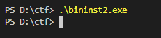
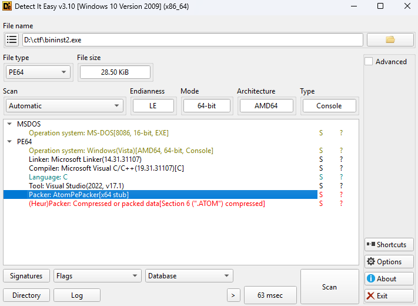
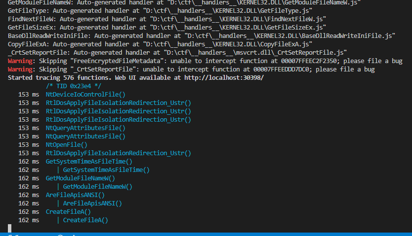
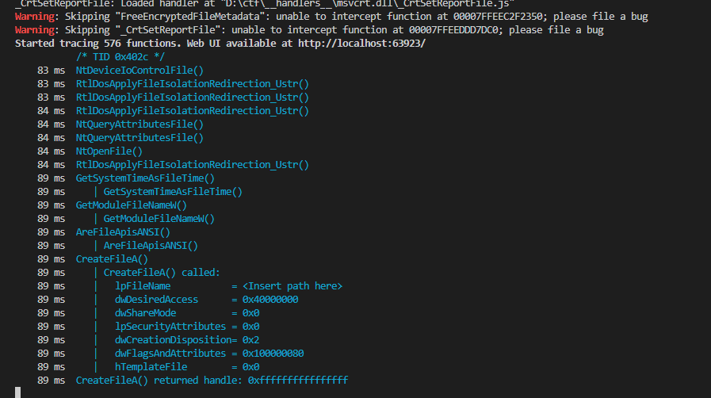
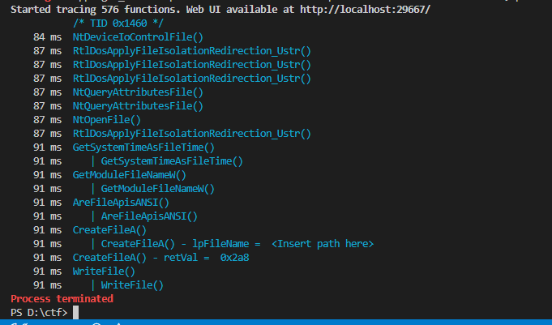
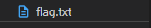
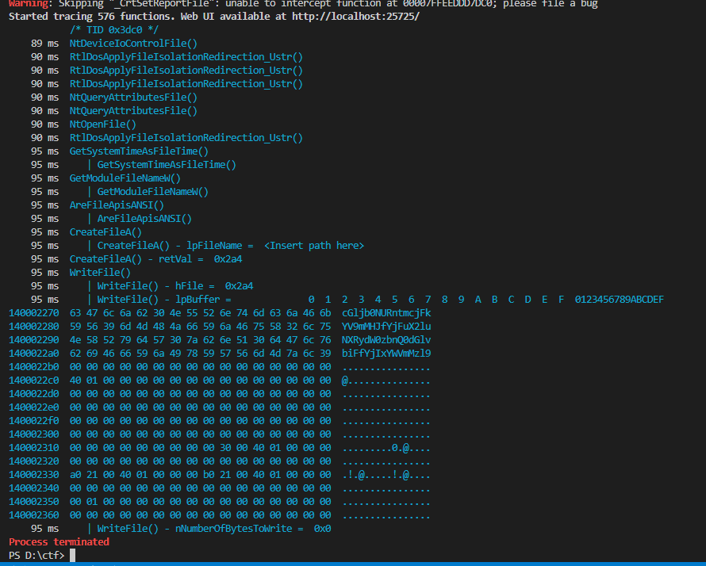
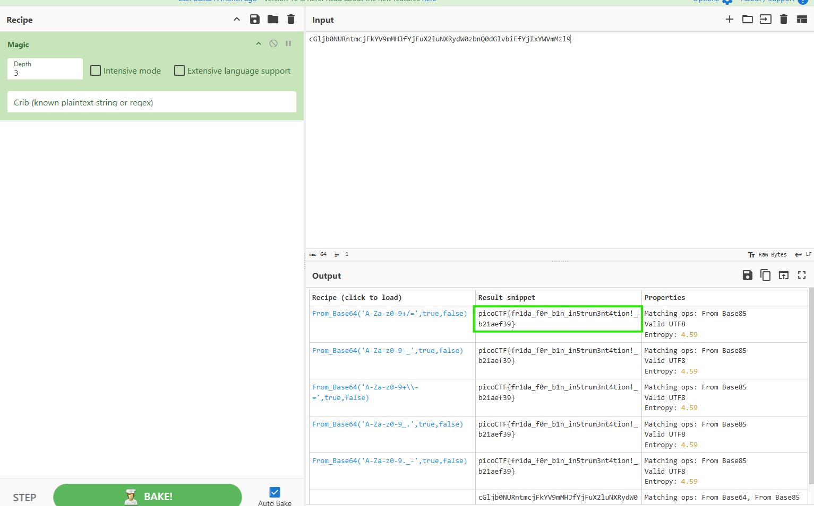

# Binary Instrumentation 2


this challange is same as [Binary Instrumentation 2](../13/)

## Description:

> I've been learning more Windows API functions to do my bidding. Hmm... I swear this program was supposed to create a file and write the flag directly to the file. Can you try and intercept the file writing function to see what went wrong?

The target binary, `bininst2.exe`, creates an file but is for some reason is not 



Our goal: to see what is the executable trying to write in the file

but before that the binary was being deleted because it was packed using [AtomPePacker](https://github.com/NUL0x4C/AtomPePacker) 

we can also cheak this using [DIE](https://github.com/horsicq/Detect-It-Easy.git)



so we will open this in an virtual machine

---

so lets see what functions does the binary call uisng `frida-trace` related to files it will also create handles for each function




here we can see that [CreateFileA](https://learn.microsoft.com/en-us/windows/win32/api/fileapi/nf-fileapi-createfilea) function is called


```c
HANDLE CreateFileA(
  [in]           LPCSTR                lpFileName,
  [in]           DWORD                 dwDesiredAccess,
  [in]           DWORD                 dwShareMode,
  [in, optional] LPSECURITY_ATTRIBUTES lpSecurityAttributes,
  [in]           DWORD                 dwCreationDisposition,
  [in]           DWORD                 dwFlagsAndAttributes,
  [in, optional] HANDLE                hTemplateFile
);
```

we can also cheak this by Modifying the handler within `__handlers__\KERNEL32.DLL\CreateFileA.js` to instrument key parameters (lpFileName) and also inspect the return value (type HANDLE).


by default it will be 


```js
defineHandler({
  onEnter(log, args, state) {
    log('CreateFileA()');
  },

  onLeave(log, retval, state) {
  }
});
```

we will modify it to 


```js
defineHandler({
  onEnter(log, args, state) {
    log('CreateFileA() called:');
    log('  lpFileName           = ' + args[0].readCString());
    log('  dwDesiredAccess      = 0x' + args[1].toString(16));
    log('  dwShareMode          = 0x' + args[2].toString(16));
    log('  lpSecurityAttributes = ' + args[3]);
    log('  dwCreationDisposition= 0x' + args[4].toString(16));
    log('  dwFlagsAndAttributes = 0x' + args[5].toString(16));
    log('  hTemplateFile        = ' + args[6]);
  },

  onLeave(log, retval, state) {
    log('CreateFileA() returned handle: ' + retval);
  }
});
```




The program called `CreateFileA()` to open a file.
The `lpFileName` argument shows `"<Insert path here>"`, which is invalid.
The function returned `0xffffffffffffffff` (i.e., `INVALID_HANDLE_VALUE`).
This indicates the file could not be created or opened.
It suggests the original programmer left a placeholder path instead of a real filename.

the string `"<Insert path here>"` is not a real file path; it’s literally a placeholder that the programmer probably meant to replace with a proper path during development. Since the program tried to create/open a file using that placeholder, Windows rejected it and `CreateFileA` returned `INVALID_HANDLE_VALUE` (`0xFFFFFFFFFFFFFFFF`).

In short: the code is broken because the intended file path was never set.


so what we will do is create our own file `flag.txt` and hook [WriteFile](https://learn.microsoft.com/en-us/windows/win32/api/fileapi/nf-fileapi-writefile) function

heres the modified version of `CreateFileA()` Hook

```js
defineHandler({
  onEnter(log, args, state) {
    log('CreateFileA() - lpFileName = ', args[0].readCString());
    // set valid file name
    const buf = Memory.allocUtf8String('flag.txt')
    this.buf = buf;
    args[0] = buf;
  },

  onLeave(log, retval, state) {
    log('CreateFileA() - retVal = ', retval)
  }
});
```



now its more like it 



and flag.txt is created

now lets Hook `WriteFile` and see what is it writing in the file

```c
BOOL WriteFile(
  [in]                HANDLE       hFile,
  [in]                LPCVOID      lpBuffer,
  [in]                DWORD        nNumberOfBytesToWrite,
  [out, optional]     LPDWORD      lpNumberOfBytesWritten,
  [in, out, optional] LPOVERLAPPED lpOverlapped
);
```

we have to now modify `__handlers__\KERNEL32.DLL\WriteFile.js`

```c
defineHandler({
  onEnter(log, args, state) {
    log('WriteFile()');
  },

  onLeave(log, retval, state) {
  }
});

```

we will modify it to: 

```c
defineHandler({
  onEnter(log, args, state) {
    log('WriteFile() - hFile = ', args[0]);
    log('WriteFile() - lpBuffer = ', hexdump(args[1]));
    log('WriteFile() - nNumberOfBytesToWrite = ', args[2]);
  },

  onLeave(log, retval, state) {
  }
});
```



the executable tried to write `cGljb0NURntmcjFkYV9mMHJfYjFuX2luNXRydW0zbnQ0dGlvbiFfYjIxYWVmMzl9` in the file

but wait this is not the right flag we will use [CyberChef](https://gchq.github.io/CyberChef) magic to get the right flag





## References:

* [Frida Documentation](https://frida.re/docs/home/)
* [Frida Tracing API](https://frida.re/docs/javascript-api/#interceptor)
* [Windows API Sleep](https://learn.microsoft.com/en-us/windows/win32/api/synchapi/nf-synchapi-sleep)

---


