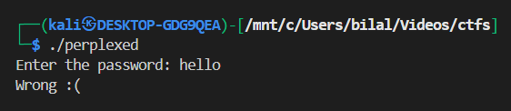
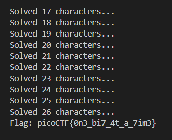
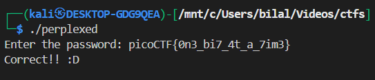

## **perplexed**

This binary is designed to recover a secret flag that has been **obfuscated at the bit level**. The flag is not stored as a plain string; instead, it is **represented by a sequence of bytes**, and each byte is checked **bit by bit** against a predefined key.

---



```c
#include <stdio.h>

// Forward declaration of check function
int check(const char *input);

int main(void)
{
    int result;
    char local_118[268] = {0};  // Initialize all bytes to 0
    int local_c;
    int bVar1;

    printf("Enter the password: ");
    fgets(local_118, sizeof(local_118), stdin); // Read input safely

    local_c = check(local_118);
    bVar1 = local_c != 1;

    if (bVar1) {
        puts("Correct!! :D");
    } else {
        puts("Wrong :(");
    }

    return !bVar1;
}
```

so this is the source code reversed from the binary

we can see that the main function calls the `check`function

lets also reverse it

```c
int check(const char *input)
{
    size_t input_len = strlen(input);

    // Check if length matches
    if (input_len != 27) { // 0x1b = 27
        return 1; // Wrong length
    }

    // Key bytes to match
    signed char key[23] = {
        -0x1f, -0x59, 0x1e, -8, 'u', '#', '{', 'a',
        -0x47, -99, -4, 'Z', '[', -0x21, 'i', 0xd2,
        -2, 0x1b, -0x13, -0x0c, -0x13, 'g', -0x0c
    };

    int bit_in_input = 0;
    int input_index = 0;

    for (unsigned int key_index = 0; key_index < 23; key_index++) {
        for (int bit = 0; bit < 8; bit++) {

            if (bit_in_input == 0)
                bit_in_input = 1;

            unsigned int key_mask   = 1 << (7 - bit);
            unsigned int input_mask = 1 << (7 - bit_in_input);

            int key_bit   = (key[key_index] & key_mask) != 0;
            int input_bit = (input[input_index] & input_mask) != 0;

            if (key_bit != input_bit) {
                return 1; // Mismatch
            }

            bit_in_input++;
            if (bit_in_input == 8) {
                bit_in_input = 0;
                input_index++;
            }

            if (input_index == input_len) {
                return 0; // Full match
            }
        }
    }

    return 0;
}
```

1. The function first checks if the input string is exactly 27 characters long; if not, it returns a mismatch.
2. It stores a predefined 23-byte key array with some characters and signed values.
3. It compares the input and key **bit by bit**, not byte by byte.
4. Two nested loops iterate over each byte of the key and each bit within the byte.
5. If a single bit in the input does not match the corresponding bit in the key, it returns 1 (mismatch).
6. It keeps track of which bit in the input is currently being compared.
7. If all bits match across all key bytes, it returns 0 (indicating the input is correct).

so we will brute force the key using this logic here's the code

```c
#include <stdio.h>
#include <string.h>

#define FLAG_LENGTH 27

char flag_candidate[FLAG_LENGTH + 1]; // current test string
char solved_flag[FLAG_LENGTH + 1];    // correctly solved part
int num_solved = 0;

// The bitwise check function
int check(const char *input)
{
    if (strlen(input) != FLAG_LENGTH)
    {
        return 1; // wrong length
    }

    // Key bytes to match bit by bit
    unsigned char key[23] = {
        0xE1, 0xA7, 0x1E, 0xF8, 'u', '#', '{', 'a',
        0xB9, 0x9D, 0xFC, 'Z', '[', 0xDF, 'i', 0xD2,
        0xFE, 0x1B, 0xED, 0xF4, 0xED, 'g', 0xF4};

    int bit_in_input = 0;
    int input_index = 0;

    for (int key_index = 0; key_index < 23; key_index++)
    {
        for (int bit = 0; bit < 8; bit++)
        {
            if (bit_in_input == 0)
                bit_in_input = 1;

            unsigned char key_mask = 1 << (7 - bit);
            unsigned char input_mask = 1 << (7 - bit_in_input);

            int key_bit = (key[key_index] & key_mask) != 0;
            int input_bit = (input[input_index] & input_mask) != 0;

            if (key_bit != input_bit)
            {
                num_solved = input_index;

                // By setting num_solved = input_index, the function records how many bytes were correct before the mismatch.

                return 1; // mismatch
            }

            bit_in_input++;
            if (bit_in_input == 8)
            {
                bit_in_input = 0;
                input_index++;
            }

            if (input_index == FLAG_LENGTH)
            {
                return 0; // full match
            }
        }
    }

    return 0; // full match
}

int main(void)
{
    int prev_num_solved = 0;
    // prev_num_solved keeps track of how many characters were solved in the previous iteration.

    int check_result = 1;

    // check_result stores the result from check(). If 0, the flag is correct; if 1, there’s a mismatch.

    while (check_result != 0)
    {
        for (char c = 0x20; c < 0x7f; c++) // Loops over all printable ASCII characters (0x20 = space, 0x7E = ~).
        {
            // keep already solved characters
            if (num_solved > 0)
            {
                strncpy(flag_candidate, solved_flag, num_solved); // Copies all already solved characters into the current candidate string.
                // This ensures we don’t overwrite previously correct characters.
            }

            // fill the rest with 'A'
            memset(&flag_candidate[num_solved], 'A', FLAG_LENGTH - num_solved); // Fills the rest of the string with dummy characters 'A'.

            // try current character
            flag_candidate[num_solved] = c;     // Sets the current character being tested at the position num_solved.
            flag_candidate[FLAG_LENGTH] = '\0'; // Null-terminates the string to make it a valid C string.

            check_result = check(flag_candidate);

            if (num_solved > prev_num_solved) // If check() determined a new character is correct, update solved_flag.
            {
                memcpy(solved_flag, flag_candidate, num_solved);
                prev_num_solved = num_solved;
                printf("Solved %d characters...\n", num_solved);

                // Copy all correctly solved characters so far.
                // Print progress to show how many characters of the flag are solved.
            }

            // stop if we reached the closing brace
            if ((num_solved > 0) && (solved_flag[num_solved - 1] == '}'))
            {
                solved_flag[num_solved] = '\0';
                printf("Flag: %s\n", solved_flag);
                return 0;
            }
        }
    }

    return 0;
}
```



now lets put this flag in the binary



