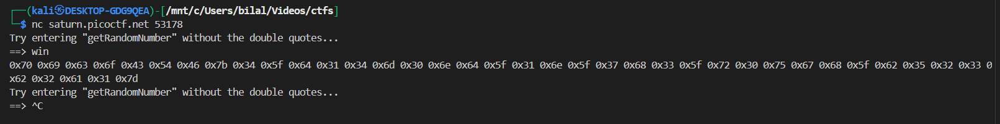
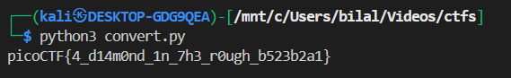

# **Picker I**

## Description:

> This service can provide you with a random number, but can it do anything else?

We are given a Python service that takes user input and executes it with:

```python
eval(user_input + '()')
```

At first glance, this looks like the service expects us to call some predefined function (e.g., `hello()`). But since it uses Python’s **`eval`**, we may be able to execute arbitrary code.

---

## Step 1 — Understanding `eval`

The function `eval` evaluates a string as Python code.

* Example:

  ```python
  eval("2+2")      # -> 4
  eval("len('hi')")  # -> 2
  ```
* Dangerous: If user input isn’t sanitized, we can run system commands or read files.

In this challenge, the input string has `()` appended, so typing:

```
foo
```

becomes:

```python
eval("foo()")
```

---

## Step 2 — First Test

We try safe inputs to confirm behavior:

```
hello
```

→ calls `hello()` (if it exists).

But we can also call **any function or expression** in Python.

---

## Step 3 — Exploitation

We suspect the flag is stored in `flag.txt`. To read it, we need Python to run a shell command or open the file.


### By using `Win` function

the binary also have an win function that reads from the flag.txt




but this is in hex form we have to convert it into ascaii

```py
hexs = "0x70 0x69 0x63 0x6f 0x43 0x54 0x46 0x7b 0x34 0x5f 0x64 0x31 0x34 0x6d 0x30 0x6e 0x64 0x5f 0x31 0x6e 0x5f 0x37 0x68 0x33 0x5f 0x72 0x30 0x75 0x67 0x68 0x5f 0x62 0x35 0x32 0x33 0x62 0x32 0x61 0x31 0x7d"
print(''.join(chr(int(x,16)) for x in hexs.split()))
```


---

## Step 4 — Getting the Flag




---
