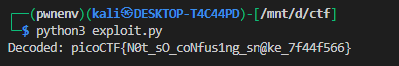

# **weirdSnake**

**Summary :**
You were given a disassembly-style text (not a `.pyc`) that implements a *repeating-key XOR* decoder. By reconstructing the original logic we recover the secret:
`picoCTF{N0t_sO_coNfus1ng_sn@ke_7f44f566}`.

---

Before you start: read these references — they’ll help you understand the bytecode and opcodes used below.

- [CPython Bytecode](./CPython_Bytecode.md)

- [Opcode reference](https://unpyc.sourceforge.net/Opcodes.html)

- [Python dis docs](https://docs.python.org/3/library/dis.html)

## Challenge description

You’re given a text file named `snake` that contains CPython disassembly output (the `dis` module format). It shows a list of `LOAD_CONST` integers, some operations that build a key string, two list comprehensions, a loop that extends the key, an XOR step, and a `''.join(map(chr, result))`. The task: recover the hidden phrase.

---

## High-level analysis (what the program does)

Reading the disassembly reveals this algorithm:

1. **Build `input_list`** — a list of 40 integers (these are the encoded bytes).
2. **Build `key_str`** by concatenation of single-character constants; final string becomes `"t_Jo3"`.
3. **Compute `key_list = [ord(c) for c in key_str]`** — convert key characters to byte values.
4. **Extend `key_list`** (repeatedly `key_list.extend(key_list)`) until its length ≥ length of `input_list` (so the key repeats).
5. **Compute `result = [a ^ b for (a,b) in zip(input_list, key_list)]`** — XOR each encoded byte with the repeated key byte.
6. **Turn `result` into text** via `''.join(map(chr, result))`.
7. The resulting string is the secret flag.

This is a classical repeating-key XOR (Vigenère-like) but using XOR.

---

## Mapping bytecode → source (line by line)

Below I map important disassembly fragments to the corresponding Python constructs.

### Input list

Disassembly shows many `LOAD_CONST` instructions then `BUILD_LIST 40` / `STORE_NAME input_list`:

```python
input_list = [
  4, 54, 41, 0, 112, 32, 25, 49, 33, 3,
  0, 0, 57, 32, 108, 23, 48, 4, 9, 70,
  7, 110, 36, 8, 108, 7, 49, 10, 4, 86,
  43, 104, 44, 91, 7, 18, 106, 124, 89, 78
]
```

### Key construction

The disassembly shows pushing `'J'`, then concatenating `'_'`, `'o'`, `'3'`, and `'t'` with `BINARY_ADD`, ultimately producing string `"t_Jo3"`. Equivalent source:

```python
key_str = 'J'
key_str = key_str + '_'
key_str = key_str + 'o'
key_str = key_str + '3'
key_str = 't' + key_str   # final key_str == "t_Jo3"
```

### key\_list via listcomp (disasm of line 9)

The `<listcomp>` disassembly shows `LOAD_GLOBAL ord` + `CALL_FUNCTION` + `LIST_APPEND`. Source:

```python
key_list = [ord(c) for c in key_str]   # -> [116, 95, 74, 111, 51]
```

### Extend until long enough (loop shown at offsets 134..160)

The loop from the bytecode:

```python
while len(key_list) < len(input_list):
    key_list.extend(key_list)
```

This doubles `key_list` repeatedly until it covers `input_list`.

### XOR listcomp (disasm of line 15)

The second `<listcomp>` shows `BINARY_XOR` and `LIST_APPEND`:

```python
result = [a ^ b for a, b in zip(input_list, key_list)]
```

### Convert to string and store result\_text

Finally the bytecode does `map(chr, result)` and `''.join(...)`:

```python
result_text = ''.join(map(chr, result))
```

---

## Reconstructed human-readable source

Save this as `recovered_snake.py` and run it to reproduce the flag.

```python
# recovered_snake.py — reconstructed from the disassembly
def decode():
    input_list = [4,54,41,0,112,32,25,49,33,3,0,0,57,32,108,23,48,4,9,70,7,110,36,8,108,7,49,10,4,86,43,104,44,91,7,18,106,124,89,78]
    # key constructed as 'J' + '_' + 'o' + '3' then prefixed by 't' -> "t_Jo3"
    key = "t_Jo3"
    key_bytes = [ord(c) for c in key]

    # Repeat key bytes until long enough
    while len(key_bytes) < len(input_list):
        key_bytes.extend(key_bytes)

    # XOR decode
    result = [a ^ b for a, b in zip(input_list, key_bytes)]

    # to text
    result_text = ''.join(map(chr, result))
    return result_text

if __name__ == "__main__":
    print(decode())
```

**Run:**

```bash
python3 recovered_snake.py
```

**Output:**


---


