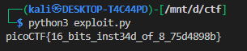

## **Transformation:** Hidden Unicode Flag

### **Description**

The challenge presented a string of **weird Unicode characters**:

```
灩捯䍔䙻ㄶ形楴獟楮獴㌴摟潦弸強㕤㐸㤸扽
```

At first glance, it looked like **random high-byte characters**, possibly CJK text. The task was to recover the **hidden flag**.

---

### **Analysis**

* The string is clearly **not readable text**.
* Observing the pattern:

  * All characters are in the **high Unicode range**, often used for obfuscation in CTFs.
  * Likely scenario: **the original ASCII flag was encoded as UTF-8, then misinterpreted as UTF-16**, producing these “weird” characters.
* Goal: **reverse the encoding to retrieve the original flag**.

---

### **Solution**

1. **Convert Unicode characters to bytes**:

   ```python
   b = s.encode('utf-16-be')
   ```

   * `.encode('utf-16-be')` treats each character as **UTF-16 Big Endian**, producing the original byte sequence that represents the flag.

2. **Decode the bytes as UTF-8**:

   ```python
   flag = b.decode('utf-8')
   print(flag)
   ```

   * The flag was originally UTF-8, so decoding the byte sequence reveals the readable text.

---

### **Full Python Exploit/Decode Script**

```python
s = "灩捯䍔䙻ㄶ形楴獟楮獴㌴摟潦弸強㕤㐸㤸扽"

# Step 1: Convert Unicode characters to bytes
b = s.encode('utf-16-be')

# Step 2: Decode bytes as UTF-8 to get flag
flag = b.decode('utf-8')
print(flag)
```


The string 灩捯䍔... was originally UTF-8 ASCII, then misinterpreted as UTF-16BE.

All characters are high Unicode code points (U+4E00–U+9FFF, plus some others).
These ranges are typically CJK (Chinese/Japanese/Korean) characters.


---

### **Result**


---


### **Tags**

```
Python, Encoding, Unicode, CTF, Logic, Hidden Content
```

