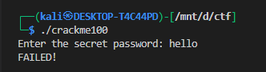
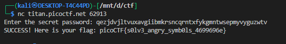

# **Classic Crackme 0x100**

## Challenge Overview

We are given a binary that prompts:



The goal is to find the correct password to pass the check and retrieve the flag. The binary’s disassembled code shows a series of bitwise manipulations applied to each character of the input over **three rounds**, then compared to a fixed scrambled output string.

---

## Step 1: Analyzing the Binary

The relevant C code is:

```c
char input[64];
char output[60] = "qhcpgbpuwbaggepulhstxbwowawfgrkzjstccbnbshekpgllze";
int secret1 = 85, secret2 = 51, secret3 = 15;
char fix = 97;
int len = strlen(output);
int i_0, i;

// Apply transformation 3 times
for (i = 0; i <= 2; ++i)
    for (i_0 = 0; i_0 < len; ++i_0) {
        random1 = (secret1 & (i_0 % 255)) + (secret1 & ((i_0 % 255) >> 1));
        random2 = (random1 & secret2) + (secret2 & (random1 >> 2));
        input[i_0] = ((random2 & secret3) + input[i_0] - fix + (secret3 & (random2 >> 4))) % 26 + fix;
    }

if (!memcmp(input, output, len))
    printf("SUCCESS! Here is your flag: %s\n", "picoCTF{sample_flag}");
else
    puts("FAILED!");
```

### Observations:

1. The program uses **three rounds of obfuscation** on the input.
2. Each character is transformed using **bitwise AND operations** with `secret1`, `secret2`, and `secret3`.
3. The result is stored in `input` and compared with the `output` string.

---

## Step 2: Understanding the Transformation

For each character at position `i_0`:

1. Compute a "pseudo-random" `random1` using `secret1` and the character index.
2. Compute `random2` using `random1` and `secret2`.
3. Apply transformations using `secret3` and a fixed offset `fix = 97` (ASCII for `'a'`).
4. Repeat three times.

Effectively, the transformation can be summarized as:

```
input[i] = (input[i] + f(i)) % 26 + 'a'
```

Where `f(i)` is determined by the bitwise secrets and the character position.

---

## Step 3: Reversing the Transformation in Python

To recover the original password, we reverse the three rounds:

```python
# Scrambled output from the binary
scrambled = "qhcpgbpuwbaggepulhstxbwowawfgrkzjstccbnbshekpgllze"

# Constants from binary
secret1 = 85
secret2 = 51
secret3 = 15
fix = 97

password_chars = []

for i_0, ch in enumerate(scrambled):
    m = i_0 % 255
    random1 = (secret1 & m) + (secret1 & (m >> 1))
    random2 = (random1 & secret2) + (secret2 & (random1 >> 2))
    A = random2 & secret3
    B = secret3 & (random2 >> 4)
    
    # Reverse three rounds
    original_ch = ((ord(ch) - fix - 3*(A + B)) % 26) + fix
    password_chars.append(chr(original_ch))

password = "".join(password_chars)
print("Recovered password:", password)
```

### How It Works:

1. The `random1` and `random2` calculations replicate the binary's logic.
2. `A` and `B` are offsets used in the transformation.
3. Subtract `3 * (A + B)` to reverse all three rounds.
4. Modulo 26 ensures the character wraps around the alphabet.
5. Adding `fix` converts it back to ASCII lowercase.

---

## Step 4: Running the Script

Executing the Python script prints the password:


---

## Step 5: Submitting the Password

Input the recovered password into the binary. It passes the `memcmp` check, and the program outputs the flag:



---
