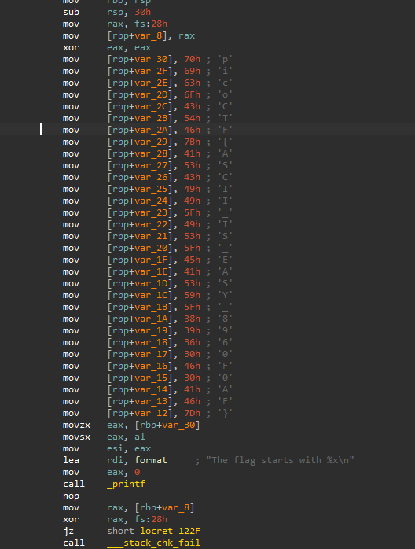

# **ASCII FTW**

## Challenge

The binary prints a hint and builds a flag from ASCII hex bytes in code. Task: disassemble the program, read the hex ASCII values, convert them to characters and produce the flag in picoCTF format.


## What I looked for

The disassembly showed a sequence of `mov [rbp+offset], 0xYY` instructions that store byte constants (hex) on the stack. Each `0xYY` maps directly to an ASCII character. Converting those hex bytes in order reconstructs the flag text.

---

## Step-by-step recovery

### 1. Produce a disassembly

If you have the binary, a straightforward way to inspect is:

```bash
objdump -d -M intel chall > dump.s   # or use your binary name
# or with a decompiler / interactive disassembler like IDA / Ghidra / radare2
```

Open `dump.s` (or view the function in your disassembler) and find the `main` function. Look for instructions that write immediate byte values into memory (e.g. `mov [rbp+...], 0x70`).

---

### 2. Locate the hex-ascii sequence

In the disassembly we saw these lines (excerpted and annotated):

```
mov [rbp+var_30], 70h ; 'p'
mov [rbp+var_2F], 69h ; 'i'
mov [rbp+var_2E], 63h ; 'c'
mov [rbp+var_2D], 6Fh ; 'o'
mov [rbp+var_2C], 43h ; 'C'
mov [rbp+var_2B], 54h ; 'T'
mov [rbp+var_2A], 46h ; 'F'
mov [rbp+var_29], 7Bh ; '{'
mov [rbp+var_28], 41h ; 'A'
mov [rbp+var_27], 53h ; 'S'
mov [rbp+var_26], 43h ; 'C'
mov [rbp+var_25], 49h ; 'I'
mov [rbp+var_24], 49h ; 'I'
mov [rbp+var_23], 5Fh ; '_'
mov [rbp+var_22], 49h ; 'I'
mov [rbp+var_21], 53h ; 'S'
mov [rbp+var_20], 5Fh ; '_'
mov [rbp+var_1F], 45h ; 'E'
mov [rbp+var_1E], 41h ; 'A'
mov [rbp+var_1D], 53h ; 'S'
mov [rbp+var_1C], 59h ; 'Y'
mov [rbp+var_1B], 5Fh ; '_'
mov [rbp+var_1A], 38h ; '8'
mov [rbp+var_19], 39h ; '9'
mov [rbp+var_18], 36h ; '6'
mov [rbp+var_17], 30h ; '0'
mov [rbp+var_16], 46h ; 'F'
mov [rbp+var_15], 30h ; '0'
mov [rbp+var_14], 41h ; 'A'
mov [rbp+var_13], 46h ; 'F'
mov [rbp+var_12], 7Dh ; '}'
```

These are ASCII hex codes. Reading them in the order they are stored produces the ASCII string.

---

### 3. Convert hex bytes → ASCII

ida pro does it very good



Concatenate the characters shown by the hex values (or convert programmatically). Doing that yields:

```
p i c o C T F { A S C I I _ I S _ E A S Y _ 8 9 6 0 F 0 A F }
```

Which is:

```
picoCTF{ASCII_IS_EASY_8960F0AF}
```

---
