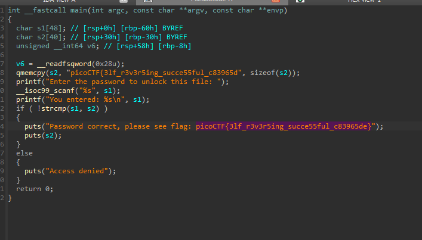
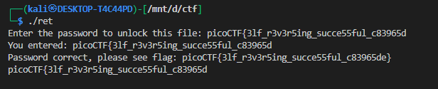

# **Reverse**

## Description:

> Try reversing this file? Can ya?

just open the file in `ida` and boom the is the flag simple as that 

Hardcoded Password: `picoCTF{3lf_r3v3r5ing_succe55ful_c83965d`

If correct, prints full flag: `picoCTF{3lf_r3v3r5ing_succe55ful_c83965de}`.

If incorrect, prints "Access denied".

we can verify it by

