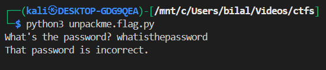
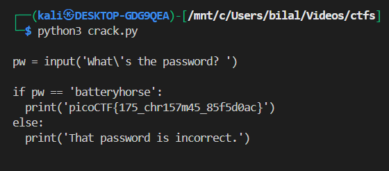
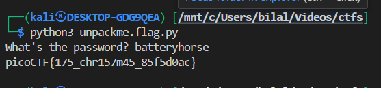

# **unpackme.py**

## Description

The challenge provides a Python script (`unpackme.flag.py`) that asks the user for a password. The goal is to obtain the **flag** without guessing the password blindly.

When run normally:



---

## Analysis

Opening the script reveals an **encrypted payload**:

```python
import base64
from cryptography.fernet import Fernet

payload = b'gAAAAABkzWGWvEp8gLI9AcIn5o-ahDUw...'
key_str = 'correctstaplecorrectstaplecorrec'
key_base64 = base64.b64encode(key_str.encode())
f = Fernet(key_base64)
plain = f.decrypt(payload)
exec(plain.decode())
```

### Observations:

1. The payload is encrypted using **Fernet symmetric encryption**.
2. The script generates a **Fernet key** from the string `correctstaplecorrectstaplecorrec`.
3. The `exec()` function runs the decrypted payload dynamically.

---

## Decrypting the Payload

We can safely **decrypt the payload** to inspect its contents without executing it blindly:

```python
from cryptography.fernet import Fernet
import base64

payload = b'gAAAAABkzWGWvEp8gLI9AcIn5o-ahDUw...'
key_str = 'correctstaplecorrectstaplecorrec'
key_base64 = base64.b64encode(key_str.encode())
f = Fernet(key_base64)

plain = f.decrypt(payload)
print(plain.decode())
```

**Decrypted Payload:**




---

## Understanding the Logic

* The **password** required to reveal the flag is `'batteryhorse'`.
* The **flag itself** is `'picoCTF{175_chr157m45_85f5d0ac}'`.
* Many beginners mistakenly try to enter the flag as the password — this fails because the program expects the actual password first.

---

## Solution

Run the script and input the correct password:



