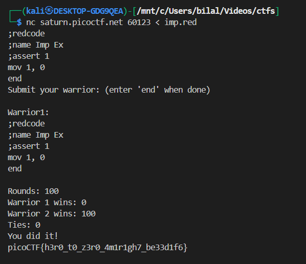

# **Ready Gladiator 0**

---

## **Challenge Description**

- The challenge provides a CoreWars server and the source code of an “Imp” warrior:

```redcode
;redcode
;name Imp Ex
;assert 1
mov 0, 1
end
```

- Your task: **submit a warrior that always loses** against this Imp warrior.

- The server will run **100 rounds**, and your warrior must **lose all rounds with no ties**.

---

## **Core War Rules Overview**

- **Core:** Circular memory where all warriors execute instructions.
- **Warriors:** Programs written in Redcode.
- **Turns/Cycles:** Warriors alternate execution one instruction at a time.
- **Termination Rules:**

  1. Warrior executes `end` → it dies immediately.
  2. Warrior executes an illegal instruction → dies.
  3. Warrior’s memory is overwritten in certain cases → can die.

- **Victory Conditions:**

  - A warrior wins if it survives longer than its opponent.
  - Tie if both die in the same cycle or both survive until max cycles.

---

## **Opponent Analysis – The Imp**

- Imp moves through memory copying itself:

```redcode
mov 0, 1
```

- This replicates its own instruction to the next memory cell.
- It does **not attack directly**, but is very resilient.
- The Imp survives **any warrior that dies quickly or does nothing**.

---

## **Losing Warrior**

One simple solution that **always loses**:

```redcode
;redcode
;name Always Lose
;assert 1
mov 1, 0
end
```

---

### **Step-by-Step Execution**

Assume the warrior is loaded at memory addresses `X` and `X+1`:

| Address | Instruction |
| ------- | ----------- |
| X       | mov 1, 0    |
| X+1     | end         |

#### **Cycle 1**

- Execute `mov 1, 0`:

  - **Source (`A`) = X+1** → `end`
  - **Destination (`B`) = X** → `mov 1, 0`

- After execution, memory becomes:

```
X   : end   ← overwritten
X+1 : end   ← unchanged
```

✅ The instruction **modifies itself**, replacing `mov 1,0` with `end`.

> [!NOTE]
> In Core War, each memory cell holds a single instruction, so you can think of a cell and its instruction as one unit.

---

#### **Cycle 2**

- The next instruction to execute is `end`.
- According to CoreWar rules, executing `end` **immediately terminates the warrior**.
- At this point, the Imp is still executing its `mov 0,1` and survives.

---

### **Why This Guarantees a Loss**

1. **Self-modifying instruction:** `mov 1,0` replaces itself with `end`.
2. **Immediate termination:** `end` kills the warrior in the next cycle.
3. **CoreWar rules:** A warrior that executes `end` dies immediately → cannot attack the Imp.
4. **Result:** Your warrior dies before the Imp → every round is lost.

- **No ties** occur because your warrior dies first.
- **No wins** occur because the warrior cannot overwrite the Imp.

---



another way can be

```bash
;redcode
;name Imp Ex
;assert 1
end
```
