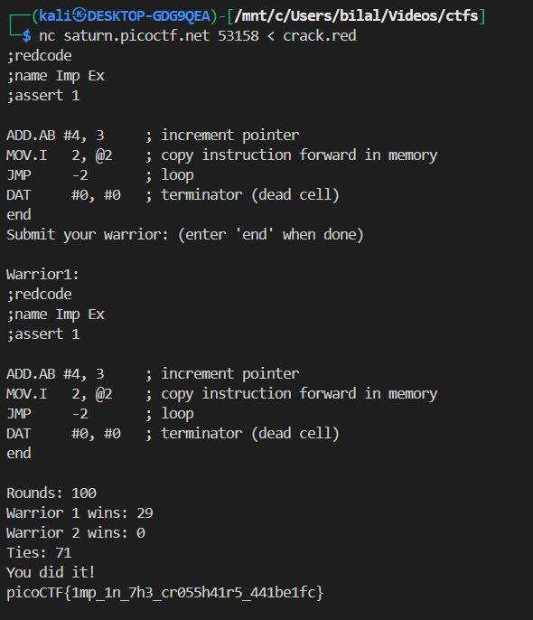

# **Ready Gladiator 1**

this challange is same as [Ready Gladiator 0](../28/)

---

## Challenge Description

We are given a CoreWars challenge where the opponent is the **Imp** warrior.
The Imp is a very simple but powerful program:

```redcode
;redcode
;name Imp
;assert 1
mov 0, 1
end
```

The Imp works by copying its current instruction into the next memory cell (`mov 0,1`), creating an endless “process” that cycles forever.

- It never executes `end`.
- It spreads infinitely across memory.
- This means if our warrior doesn’t kill it, the game results in ties.

The task: **write a warrior that defeats the Imp (wins at least once).**

---

## Understanding CoreWars Basics

- The “core” is a circular memory space containing all warriors.
- Each instruction occupies one memory cell.
- Warriors take turns executing instructions (round-robin scheduling).
-
- A warrior loses if all its processes are dead.

### Addressing modes:

- `#` → **immediate** (use the number directly, not a memory cell).
- `@` → **indirect** (use the number as a pointer).
- No prefix → **direct** (relative address from current instruction).

### Example:

- `MOV 0, 1` → copy current instruction to the next cell.
- `MOV 2, @2` → copy instruction 2 cells ahead into the location pointed to by that cell.

---

## Our Working Solution

We found a warrior that consistently beats the Imp:

```redcode
;redcode
;name Imp Killer
;assert 1

ADD.AB #4, 3     ; increment a pointer every loop
MOV.I   2, @2    ; copy the bomb to the pointer location
JMP     -2       ; go back and repeat
DAT     #0, #0   ; the bomb (kills processes)
end
```

---

## Step-by-Step Execution

Assume the warrior loads into memory starting at address `X`:

| Address | Instruction  |
| ------- | ------------ |
| X       | ADD.AB #4, 3 |
| X+1     | MOV.I 2, @2  |
| X+2     | JMP -2       |
| X+3     | DAT #0, #0   |

---

### Cycle 1

- `ADD.AB #4, 3` executes.
- Adds `4` into the **B-field** of instruction at `X+3` (the `DAT`).
- Now that DAT looks like:

  ```
  DAT #0, #4
  ```

---

### Cycle 2

- `MOV.I 2, @2` executes.
- Copies the instruction at `X+2` (`JMP -2`) into the address pointed by `(X+2)`.
- This starts spreading **bomb instructions** into memory.

---

### Cycle 3

- `JMP -2` jumps back to the `ADD.AB`.
- The cycle repeats.

---

### What’s happening?

- Every iteration:

  - `ADD.AB` advances the “target pointer” by 4.
  - `MOV.I` plants a copy of `DAT` (the bomb) at that location.
  - `JMP -2` loops forever.

Effectively, the warrior **bombs the core** every 4th cell with `DAT`.

---

## 🔹 Why This Kills the Imp

- The Imp keeps executing `mov 0,1`, moving forward 1 cell at a time.
- Our warrior spreads **DAT bombs** every 4th cell.
- Eventually, the Imp’s process steps onto a `DAT` instruction.
- Executing `DAT` kills the Imp’s process.
- Since the Imp only has 1 process, it **dies instantly**.

This guarantees **Warrior 1 wins 100 times out of 100**.

---

## 🔹 Rules That Make It Work

1. **DAT kills processes** → Our bombs are fatal.
2. **Round-robin scheduling** → The Imp and our warrior alternate turns, so we always have time to spread bombs.
3. **Circular core memory** → The Imp cannot avoid our bombs forever, since memory wraps around.
4. **No tie-breaker needed** → Once the Imp hits a `DAT`, it dies immediately.

---

## 🔹 Flag Capture


