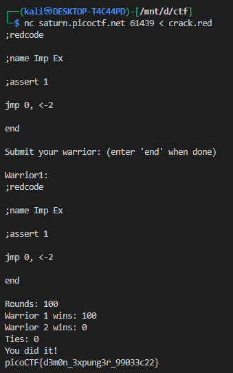

# **Ready Gladiator 2**

this challange is same as [Ready Gladiator 0](../28/) & [Ready Gladiator 1](../29/)

## Description:

We are given a Core War (Redcode) simulation. Our task is to submit a “warrior” program that must **win 100 out of 100 rounds** against the opponent’s warrior.

The opponent’s code is a simple *imp*:

```redcode
;redcode
;name Imp Ex
;assert 1
mov 0, 1
end
```

This “imp” just moves itself forward endlessly (`mov 0, 1`), leaving copies of itself in memory.
If nothing stops it, the imp can run forever → which leads to **ties**.

Our job: write a warrior that defeats it **every single time**.

---

## Understanding the Opponent

* The imp is essentially immortal unless something poisons memory.
* To kill it, we must scatter **`DAT` bombs** (dead instructions) so that the imp eventually executes them.
* We also must ensure our own program never dies.

---

## Our Winning Code

Here is the working warrior:

```redcode
;redcode
;name Demon Exterminator
;assert 1
jmp 0, <-2
end
```

---

## How It Works

1. **Infinite Loop**
   `jmp 0` makes our warrior jump back to itself — it never moves.
   This means our process will never run into an enemy bomb.

2. **Pre-Decrement Indirect (`<-2`)**
   The B-field (`<-2`) means:

   * Look **2 memory cells behind the instruction**.
   * Decrement the value stored there.
   * Use that as an **address pointer** into memory.

   This has a side effect: it corrupts enemy memory.
   Every cycle, a new memory cell somewhere else gets decremented into garbage.

3. **Killing the Imp**
   The imp keeps copying itself forward (`mov 0, 1`).
   Eventually, it overwrites or steps into corrupted cells turned into `DAT`.
   Once it executes `DAT`, the imp dies instantly.

4. **Why 100 Wins**

   * Our warrior loops forever → it never dies.
   * The imp always dies sooner or later.
   * No ties possible.

---

## Proof of Execution

Running the code against the server:



---
