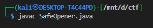
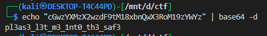
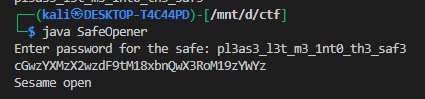

# **Safe Opener**

## **Description**

**Files given**

* `SafeOpener.java` (source)

```java
import java.io.*;
import java.util.*;  
public class SafeOpener {
    public static void main(String args[]) throws IOException {
        BufferedReader keyboard = new BufferedReader(new InputStreamReader(System.in));
        Base64.Encoder encoder = Base64.getEncoder();
        String encodedkey = "";
        String key = "";
        int i = 0;
        boolean isOpen;
        

        while (i < 3) {
            System.out.print("Enter password for the safe: ");
            key = keyboard.readLine();

            encodedkey = encoder.encodeToString(key.getBytes());
            System.out.println(encodedkey);
              
            isOpen = openSafe(encodedkey);
            if (!isOpen) {
                System.out.println("You have  " + (2 - i) + " attempt(s) left");
                i++;
                continue;
            }
            break;
        }
    }
    
    public static boolean openSafe(String password) {
        String encodedkey = "cGwzYXMzX2wzdF9tM18xbnQwX3RoM19zYWYz";
        
        if (password.equals(encodedkey)) {
            System.out.println("Sesame open");
            return true;
        }
        else {
            System.out.println("Password is incorrect\n");
            return false;
        }
    }
}
```


i just compiled it uisng 



* `SafeOpener.class` (compiled)

**What the program does (quick)**

* Prompts user for a password (3 attempts).
* Base64-encodes whatever you type and prints the encoded string.
* Compares the encoded string to a hard-coded Base64 constant:

  ```
  cGwzYXMzX2wzdF9tM18xbnQwX3RoM19zYWYz
  ```
* If they match, prints `Sesame open` and the safe is opened.

---

## Exploit / solution (one-liner)

The program compares your **Base64-encoded input** to a constant. Decode that constant to get the real password.

Command used:

```bash
echo "cGwzYXMzX2wzdF9tM18xbnQwX3RoM19zYWYz" | base64 -d
```

Output (the password to enter):



Enter that when the program prompts and it opens.

---

## Flag

lets prove if it is right or not




