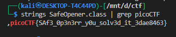
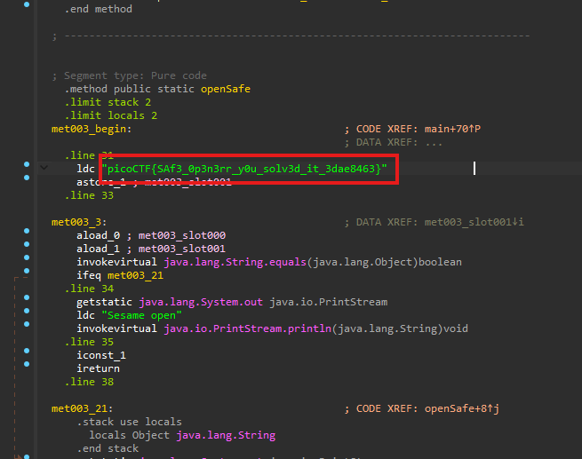

# **Safe Opener 2**

this chalange is some how same as [Safe Opener](../31/)


## Description

> What can you do with this file? I forgot the key to my safe but this file is supposed to help me with retrieving the lost key. Can you help me unlock my safe?

The challenge provided a Java class (`SafeOpener.class`) that checks a Base64-encoded password. By inspecting the class file we recover the flag directly from the binary’s constant pool.


---

## Files provided

* `SafeOpener.class` (Java bytecode)

---


**Quick strings search**

A fast way to find embedded strings in a binary:

```bash
strings SafeOpener.class | grep picoCTF
```

Output:

 

That reveals the flag as an embedded literal.



the flag was just hard coded 

