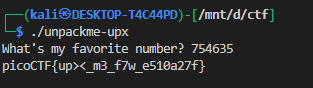

# **unpackme**

## Description

> Can you get the flag? Reverse engineer this binary.

Let's first see if it is packed or not.

It is packed using [UPX](https://github.com/upx/upx.git).

We can also see this by using [DIE (Detect-It-Easy)](https://github.com/horsicq/Detect-It-Easy.git).

Let's unpack it using UPX.

When we run the binary it asks for our favourite colour — or, let's say, it's 😒

Let's open it in IDA and see what its favourite colour is.

Hmm — its favourite colour is `754635`. What colour is this? 😒

