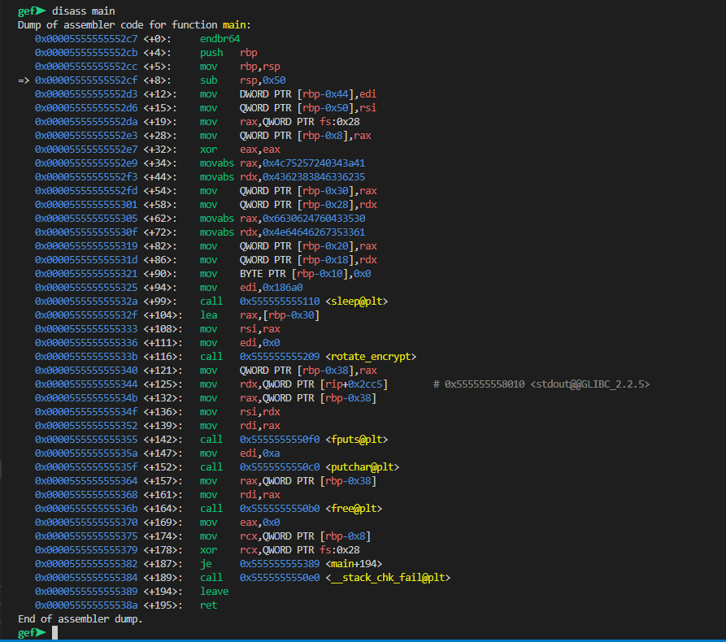
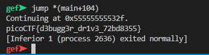
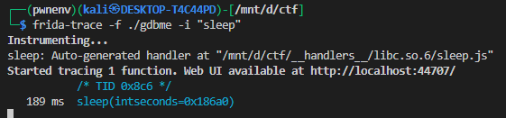
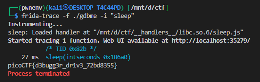

# **GDB Test Drive**

## Description

The binary `gdbme` has a long `sleep` call (`sleep(0x186A0)`), which effectively pauses execution for over a day. The goal is to bypass this delay to quickly analyze the program.

---


Looking at the main function:

```c
strcpy(v5, "A:4@r%uL5b3F88bC05C`Gb0fa35gbddN");
sleep(0x186A0u);
s = (char *)rotate_encrypt(0LL, v5);
fputs(s, _bss_start);
```

* The program copies a string, sleeps, then encrypts it and prints it.
* Waiting for the full sleep duration is impractical, so we need to bypass it.

---


# **GDB**

we will open the file in gdb and set an break point at `main` and call `run`

the disass of main will look like this




we will first set an break point at `sleep` 

```bash
break *(main+99)
```

run the binary and then jmp to `jump *(main+104)` ultimatelly skipping the sleep




---


I was boored so i did this challange twice 😒


# **frida**

We can use **Frida**, a dynamic instrumentation toolkit, to intercept and skip the `sleep` call at runtime.


```bash
frida-trace -f ./gdbme -i "sleep"
```

* `-f` launches the binary.
* `-i` include FUNCTION.



now it has created hooks in `__handlers__/libc.so.6/sleep.js`

by default it will look like this

```js
defineHandler({
  onEnter(log, args, state) {
    log(`sleep(intseconds=${args[0]})`);
  },

  onLeave(log, retval, state) {
  }
});

```

we will modify it to


```js
defineHandler({
  onEnter(log, args, state) {
    log(`sleep(intseconds=${args[0]})`);
    args[0] = ptr('5');  // changing sleep duration to 5 seconds
  },

  onLeave(log, retval, state) {
  }
});
```

* This completely skips the delay.

---

### Running the Script




---

## Conclusion

By intercepting the `sleep` function with Frida, we can bypass long delays in binaries without modifying the executable itself. This is especially useful in **reverse engineering challenges** where artificial delays are used to slow down analysis.

---

