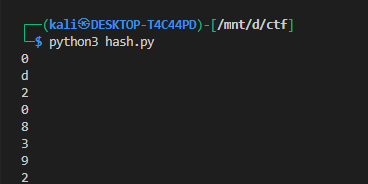

# **keygenme-py**

## **Description:**

The Arcane Calculator trial version restricts some features and asks for a license key to unlock the full version. The `check_key` function validates a user-provided key based on the SHA-256 hash of the username.

---

### **Step 1: Understand the key format**

From the source code:

```python
key_part_static1_trial = "picoCTF{1n_7h3_|<3y_of_"
key_part_dynamic1_trial = "xxxxxxxx"  # 8 characters derived from username hash
key_part_static2_trial = "}"
```

So the key format is:

```
picoCTF{1n_7h3_|<3y_of_<8_DYNAMIC_CHARS>}
```

* The first part is static (`key_part_static1_trial`), always the same.
* The last character is static (`key_part_static2_trial` = `}`).
* The middle 8 characters (`key_part_dynamic1_trial`) are **derived from the username SHA-256 hash**.

---

### **Step 2: Dynamic part rules**

The dynamic 8 characters are taken from **specific indices** of the SHA-256 hash of the username:

```python
hashlib.sha256(username_trial).hexdigest()[4]
hashlib.sha256(username_trial).hexdigest()[5]
hashlib.sha256(username_trial).hexdigest()[3]
hashlib.sha256(username_trial).hexdigest()[6]
hashlib.sha256(username_trial).hexdigest()[2]
hashlib.sha256(username_trial).hexdigest()[7]
hashlib.sha256(username_trial).hexdigest()[1]
hashlib.sha256(username_trial).hexdigest()[8]
```

> Order of indices: `[4, 5, 3, 6, 2, 7, 1, 8]`

---

### **Step 3: Compute SHA-256 of the username**

Username in the trial:

```python
username = b"FREEMAN"
```

Python snippet:

```python
import hashlib

username = b"FREEMAN"
hash_hex = hashlib.sha256(username).hexdigest()
print(hash_hex[4])
print(hash_hex[5])
print(hash_hex[3])
print(hash_hex[6])
print(hash_hex[2])
print(hash_hex[7])
print(hash_hex[1])
print(hash_hex[8])
```




### **Step 4: Construct the full key**

Combine all parts:

```python
full_key = key_part_static1_trial + dynamic_part + key_part_static2_trial
```

Example (from your computed hash):

```
picoCTF{1n_7h3_|<3y_of_0d208392}
```


---

A new file `keygenme.py` is created after this
