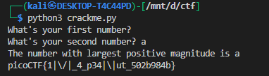
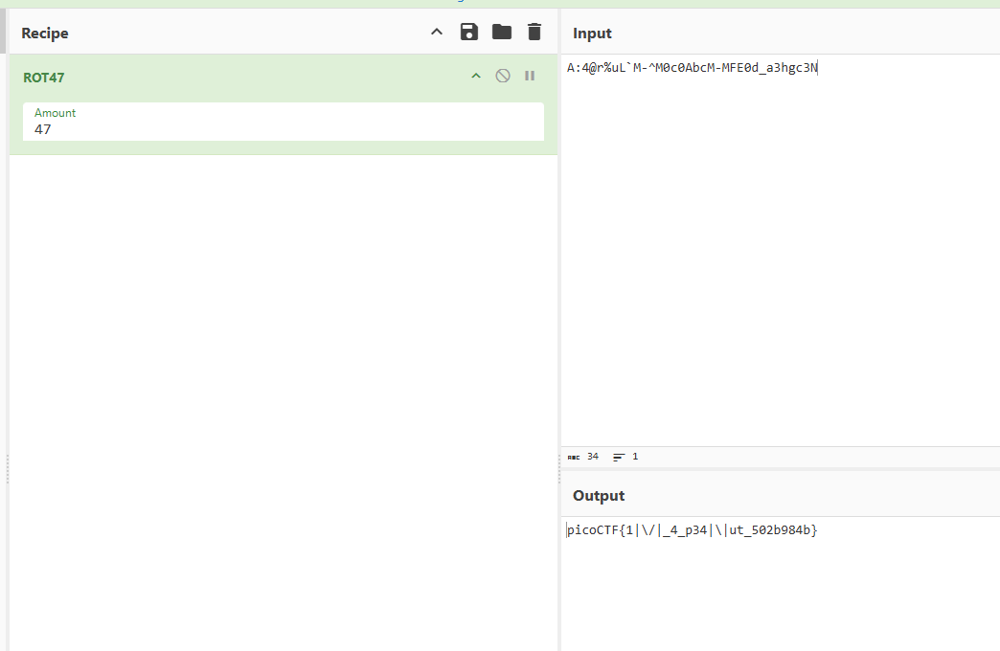
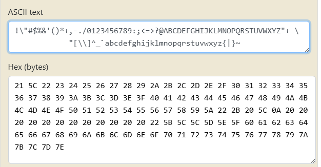

# **crackme-py**

## Description:

> This Python script has two main parts: it defines a ROT47-based function to decode an encrypted secret, and a function that asks the user for two numbers and prints the larger one. The ROT47 decoder is defined but not called, so the secret remains hidden. The script demonstrates simple string manipulation, conditional logic, and user input handling.


### **SOURCE:**

```py
# Hiding this really important number in an obscure piece of code is brilliant!
# AND it's encrypted!
# We want our biggest client to know his information is safe with us.
bezos_cc_secret = "A:4@r%uL`M-^M0c0AbcM-MFE0d_a3hgc3N"

# Reference alphabet
alphabet = "!\"#$%&'()*+,-./0123456789:;<=>?@ABCDEFGHIJKLMNOPQRSTUVWXYZ"+ \
            "[\\]^_`abcdefghijklmnopqrstuvwxyz{|}~"


def decode_secret(secret):
    """ROT47 decode

    NOTE: encode and decode are the same operation in the ROT cipher family.
    """

    # Encryption key
    rotate_const = 47

    # Storage for decoded secret
    decoded = ""

    # decode loop
    for c in secret:
        index = alphabet.find(c)
        original_index = (index + rotate_const) % len(alphabet)
        decoded = decoded + alphabet[original_index]

    print(decoded)


def choose_greatest():
    """Echo the largest of the two numbers given by the user to the program

    Warning: this function was written quickly and needs proper error handling
    """

    user_value_1 = input("What's your first number? ")
    user_value_2 = input("What's your second number? ")
    greatest_value = user_value_1 # need a value to return if 1 & 2 are equal

    if user_value_1 > user_value_2:
        greatest_value = user_value_1
    elif user_value_1 < user_value_2:
        greatest_value = user_value_2

    print( "The number with largest positive magnitude is "
        + str(greatest_value) )


choose_greatest()

```


well its simple we will call the `decode_secret` function with `bezos_cc_secret` as argument


```py
decode_secret(bezos_cc_secret)
```

it will decode the flag





we can also use [CyberChef](https://gchq.github.io/CyberChef/)




---

>[!NOTE]: 

ROT47 is a simple **substitution cipher** that shifts each printable ASCII character by 47 positions. It’s like ROT13 (which shifts letters by 13) but works on **all printable characters**, not just letters.

For example:

* `'A'` becomes `'p'`
* `'!'` becomes `'0'`

The cool part: **encoding and decoding are the same operation** — applying ROT47 twice gets you back the original text.

It’s mostly used for lightweight obfuscation, not real security.

ROT47 only shifts printable ASCII characters, which are 94 characters from ! (33) to ~ (126).

The string alphabet is just a list of those 94 characters in order.
When decoding/encoding, each character’s index in this string is shifted by 47 (mod 94), so you get the ROT47 transformation.





if you want to learn more about `ROT47` click [here](https://blog.gcwizard.net/manual/en/rotation/06-what-is-rot-47/)


