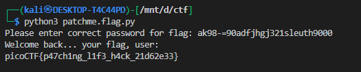

# **patchme.py**


## Description:

> Can you get the flag? Run this Python program in the same directory as this encrypted flag.


**SOURCE:**


```py
### THIS FUNCTION WILL NOT HELP YOU FIND THE FLAG --LT ########################
def str_xor(secret, key):
    #extend key to secret length
    new_key = key
    i = 0
    while len(new_key) < len(secret):
        new_key = new_key + key[i]
        i = (i + 1) % len(key)        
    return "".join([chr(ord(secret_c) ^ ord(new_key_c)) for (secret_c,new_key_c) in zip(secret,new_key)])
###############################################################################


flag_enc = open('flag.txt.enc', 'rb').read()


def level_1_pw_check():
    user_pw = input("Please enter correct password for flag: ")
    if( user_pw == "ak98" + \
                   "-=90" + \
                   "adfjhgj321" + \
                   "sleuth9000"):
        print("Welcome back... your flag, user:")
        decryption = str_xor(flag_enc.decode(), "utilitarian")
        print(decryption)
        return
    print("That password is incorrect")


level_1_pw_check()
```

**Purpose:**

The script is designed to protect a flag stored in `flag.txt.enc` using a combination of a password check and XOR encryption. The actual flag is encrypted and only revealed if the correct password is provided.

flag.txt.enc has

```bash

* '	UYX+
CR1@
6FP_SFG
```


**Password Check:**

* The function `level_1_pw_check()` prompts the user for a password.
* The correct password is a concatenation of several strings:

```
"ak98" + "-=90" + "adfjhgj321" + "sleuth9000"
```
* If the entered password matches exactly, the program proceeds to decrypt the flag. Otherwise, it prints an error message.


**Flag Decryption:**

* The `str_xor(secret, key)` function performs a simple XOR operation between the secret (the encrypted flag) and a repeating key (`"utilitarian"`).
* The decryption is only executed if the correct password is provided.
* Once decrypted, the plaintext flag is printed to the user.

