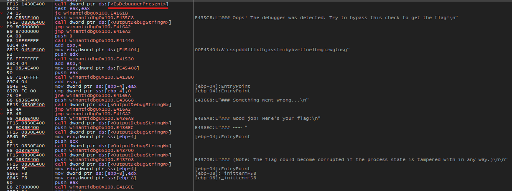

# **WinAntiDbg0x100**

We were given a program that only run when it is run using a debugger

### Description

> This challenge will introduce you to 'Anti-Debugging.' Malware developers don't like it when you attempt to debug their executable files because debugging these files reveals many of their secrets! That's why, they include a lot of code logic specifically designed to interfere with your debugging process.
Now that you've understood the context, go ahead and debug this Windows executable!

so i will use `x32dbg`

if i run it now we get this out put:

we get this:

"### Oops! The debugger was detected. Try to bypass this check to get the flag!"

so we now have to bypass this cheak of debugger there is an funtion `isDebuggerPressent()` which cheaks for if debugger is present or not 

we know that the result is stored in eax after this the `test eax,eax` instruction sets the `EFLAGS` which is than used to control the flow of  execution and one of them is `Zero Flag`

If ZF = 1 → jump is taken.
If ZF = 0 → execution continues sequentially.

here if i set break point and see the value of zero flag it is equal to `0` meaning that there will be no jump and execution continues sequentially.

so for it to jump we need to toggle its value to `1` 

now if we countinue we will get the flag

