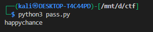
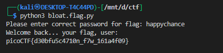

# **bloat.py**

## **Description**

We are given a Python script (`bloat.flag.py`) that reads an encrypted flag from a file (`flag.txt.enc`) and asks the user for a password before decrypting the flag. The goal is to retrieve the flag.

---


```py
import sys
a = "!\"#$%&'()*+,-./0123456789:;<=>?@ABCDEFGHIJKLMNOPQRSTUVWXYZ"+ \
            "[\\]^_`abcdefghijklmnopqrstuvwxyz{|}~ "
def arg133(arg432):
  if arg432 == a[71]+a[64]+a[79]+a[79]+a[88]+a[66]+a[71]+a[64]+a[77]+a[66]+a[68]:
    return True
  else:
    print(a[51]+a[71]+a[64]+a[83]+a[94]+a[79]+a[64]+a[82]+a[82]+a[86]+a[78]+\
a[81]+a[67]+a[94]+a[72]+a[82]+a[94]+a[72]+a[77]+a[66]+a[78]+a[81]+\
a[81]+a[68]+a[66]+a[83])
    sys.exit(0)
    return False
def arg111(arg444):
  return arg122(arg444.decode(), a[81]+a[64]+a[79]+a[82]+a[66]+a[64]+a[75]+\
a[75]+a[72]+a[78]+a[77])
def arg232():
  return input(a[47]+a[75]+a[68]+a[64]+a[82]+a[68]+a[94]+a[68]+a[77]+a[83]+\
a[68]+a[81]+a[94]+a[66]+a[78]+a[81]+a[81]+a[68]+a[66]+a[83]+\
a[94]+a[79]+a[64]+a[82]+a[82]+a[86]+a[78]+a[81]+a[67]+a[94]+\
a[69]+a[78]+a[81]+a[94]+a[69]+a[75]+a[64]+a[70]+a[25]+a[94])
def arg132():
  return open('flag.txt.enc', 'rb').read()
def arg112():
  print(a[54]+a[68]+a[75]+a[66]+a[78]+a[76]+a[68]+a[94]+a[65]+a[64]+a[66]+\
a[74]+a[13]+a[13]+a[13]+a[94]+a[88]+a[78]+a[84]+a[81]+a[94]+a[69]+\
a[75]+a[64]+a[70]+a[11]+a[94]+a[84]+a[82]+a[68]+a[81]+a[25])
def arg122(arg432, arg423):
    arg433 = arg423
    i = 0
    while len(arg433) < len(arg432):
        arg433 = arg433 + arg423[i]
        i = (i + 1) % len(arg423)        
    return "".join([chr(ord(arg422) ^ ord(arg442)) for (arg422,arg442) in zip(arg432,arg433)])
arg444 = arg132()
arg432 = arg232()
arg133(arg432)
arg112()
arg423 = arg111(arg444)
print(arg423)
sys.exit(0)
```

---


## **Step 1: Understanding the script**

The script defines a character table `a`:

```python
a = "!\"#$%&'()*+,-./0123456789:;<=>?@ABCDEFGHIJKLMNOPQRSTUVWXYZ[\\]^_`abcdefghijklmnopqrstuvwxyz{|}~ "
```

* This table contains all printable ASCII characters.
* The challenge uses indices into this table instead of plain text for passwords and messages.

---

### **Password Check**

The password check is performed in `arg133()`:

```python
if arg432 == a[71]+a[64]+a[79]+a[79]+a[88]+a[66]+a[71]+a[64]+a[77]+a[66]+a[68]:
    return True
```

* This concatenates characters from `a` to build the correct password.
* Printing these indices gives the actual password:

```python
print(a[71]+a[64]+a[79]+a[79]+a[88]+a[66]+a[71]+a[64]+a[77]+a[66]+a[68])
```

**Output:**



✅ This is the password required to decrypt the flag.

---

### **Flag Decryption**

The flag is read from `flag.txt.enc`:

```python
arg444 = open('flag.txt.enc', 'rb').read()
```

* The decryption is done using a **repeating-key XOR** in `arg122()` with a key derived from `a`.
* The decrypted flag is printed after the password check.

---

## **Step 2: Running the Script**

1. Enter the password when prompted:



---


## **Tags**

* `python`
* `reverse-engineering`
* `crypto`
* `XOR`
* `obfuscation`
* `ctf`

---
