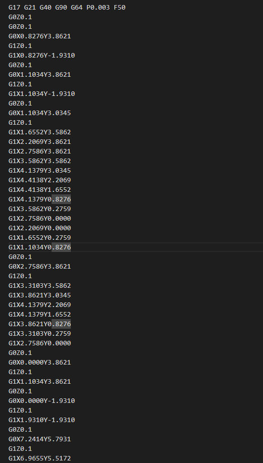
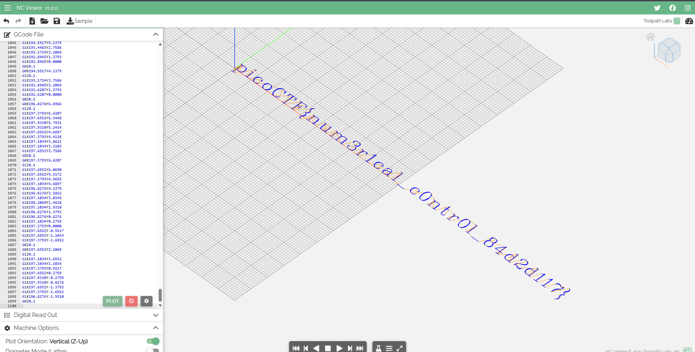

# **speeds and feeds**

## **Description:**

In this challenge, we are given a set of G-code instructions. G-code is the standard language used to control CNC machines, 3D printers, and other automated tools. The task is to figure out what these instructions are “drawing” or producing and extract the flag from it.

---


when we run the command

```bash
nc mercury.picoctf.net 28067 < gcode.txt
```

it give us g-code 




## **Analysis:**

**G-code basics:**

* `G0` – Rapid move (move without cutting or drawing).
* `G1` – Linear move (cutting or drawing along a line).
* `G17` – XY plane selection.
* `G21` – Units in millimeters.
* `G40` – Cancel tool radius compensation.
* `G90` – Absolute positioning.
* `F` – Feed rate (speed of movement).

click [here](https://howtomechatronics.com/tutorials/g-code-explained-list-of-most-important-g-code-commands/) to learn more abourt G-code


**Observation of instructions:**
The provided G-code contains a series of `G0` and `G1` commands with X, Y, and Z coordinates. The `Z` values indicate whether the tool is “up” or “down,” effectively indicating drawing or movement without drawing.

Example snippet:

```
G1 X135.3793 Y1.1034
G1 X135.6552 Y0.5517
G1 X135.9310 Y0.2759
G0 Z0.1
```

* `G1` with small movements corresponds to drawing.
* `G0 Z0.1` lifts the tool, preparing for a move without drawing.
* These coordinates together form the outlines of letters or shapes.

1. **Flag extraction:**

offcorce i am not going to look into the code i will open the g-code by using [ncviewer](https://ncviewer.com/)





and there is our flag `picoCTF{num3r1cal_c0ntr0l_84d2d117}`

---
