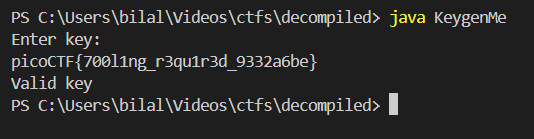
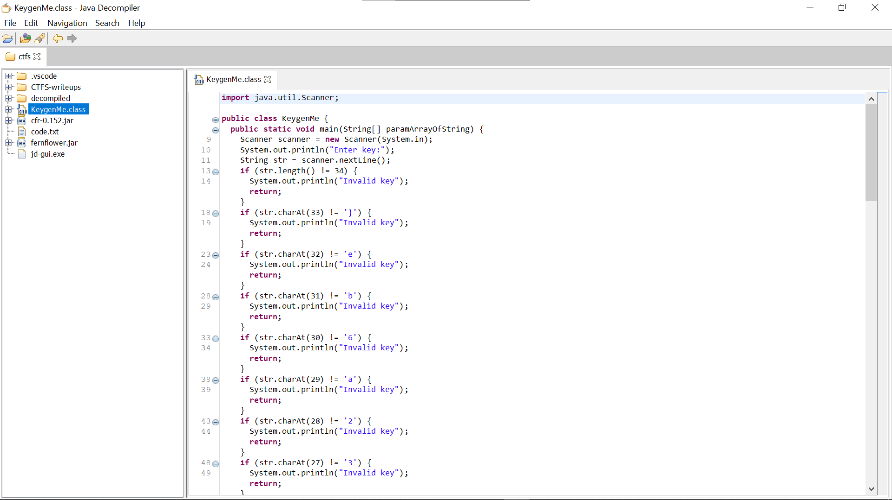
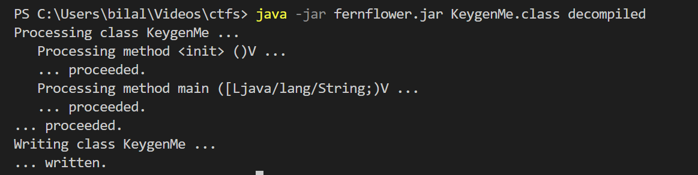

## **Fresh Java**

## Description:

> Can you get the flag?

---

### **Challenge Description**

We are given a Java class file:

```
KeygenMe.class
```

The challenge asks us to find the **correct key** to pass validation. Running the file directly may give errors if Java is not handling class files correctly, so decompilation is necessary.

---

### Decompile the Class\*\*

**Using CFR**

Since it is a Java `.class` file, we can use **CFR** (Class File Reader) to decompile it:

```bash
java -jar cfr-0.152.jar KeygenMe.class > KeygenMe.java
```

This outputs a human-readable Java file `KeygenMe.java`.

```java
import java.util.Scanner;

public class KeygenMe {

   public static void main(String[] var0) {
      Scanner var1 = new Scanner(System.in);
      System.out.println("Enter key:");
      String var2 = var1.nextLine();
      if(var2.length() != 34) {
         System.out.println("Invalid key");
      } else if(var2.charAt(33) != 125) {
         System.out.println("Invalid key");
      } else if(var2.charAt(32) != 101) {
         System.out.println("Invalid key");
      } else if(var2.charAt(31) != 98) {
         System.out.println("Invalid key");
      } else if(var2.charAt(30) != 54) {
         System.out.println("Invalid key");
      } else if(var2.charAt(29) != 97) {
         System.out.println("Invalid key");
      } else if(var2.charAt(28) != 50) {
         System.out.println("Invalid key");
      } else if(var2.charAt(27) != 51) {
         System.out.println("Invalid key");
      } else if(var2.charAt(26) != 51) {
         System.out.println("Invalid key");
      } else if(var2.charAt(25) != 57) {
         System.out.println("Invalid key");
      } else if(var2.charAt(24) != 95) {
         System.out.println("Invalid key");
      } else if(var2.charAt(23) != 100) {
         System.out.println("Invalid key");
      } else if(var2.charAt(22) != 51) {
         System.out.println("Invalid key");
      } else if(var2.charAt(21) != 114) {
         System.out.println("Invalid key");
      } else if(var2.charAt(20) != 49) {
         System.out.println("Invalid key");
      } else if(var2.charAt(19) != 117) {
         System.out.println("Invalid key");
      } else if(var2.charAt(18) != 113) {
         System.out.println("Invalid key");
      } else if(var2.charAt(17) != 51) {
         System.out.println("Invalid key");
      } else if(var2.charAt(16) != 114) {
         System.out.println("Invalid key");
      } else if(var2.charAt(15) != 95) {
         System.out.println("Invalid key");
      } else if(var2.charAt(14) != 103) {
         System.out.println("Invalid key");
      } else if(var2.charAt(13) != 110) {
         System.out.println("Invalid key");
      } else if(var2.charAt(12) != 49) {
         System.out.println("Invalid key");
      } else if(var2.charAt(11) != 108) {
         System.out.println("Invalid key");
      } else if(var2.charAt(10) != 48) {
         System.out.println("Invalid key");
      } else if(var2.charAt(9) != 48) {
         System.out.println("Invalid key");
      } else if(var2.charAt(8) != 55) {
         System.out.println("Invalid key");
      } else if(var2.charAt(7) != 123) {
         System.out.println("Invalid key");
      } else if(var2.charAt(6) != 70) {
         System.out.println("Invalid key");
      } else if(var2.charAt(5) != 84) {
         System.out.println("Invalid key");
      } else if(var2.charAt(4) != 67) {
         System.out.println("Invalid key");
      } else if(var2.charAt(3) != 111) {
         System.out.println("Invalid key");
      } else if(var2.charAt(2) != 99) {
         System.out.println("Invalid key");
      } else if(var2.charAt(1) != 105) {
         System.out.println("Invalid key");
      } else if(var2.charAt(0) != 112) {
         System.out.println("Invalid key");
      } else {
         System.out.println("Valid key");
      }
   }
}

```

---

### **Analyze the Decompiled Code**

After decompiling, we get the following logic:

- The program prompts for a key:

```java
System.out.println("Enter key:");
String string = scanner.nextLine();
```

- It validates **length**:

```java
if (string.length() != 34) {
    System.out.println("Invalid key");
    return;
}
```

- Then it checks each character individually using `charAt()`:

```java
if (string.charAt(0) != 'p') return;
if (string.charAt(1) != 'i') return;
...
if (string.charAt(33) != '}') return;
```

This is a classic **hardcoded key check**. By reading each `charAt` check, we can reconstruct the key.

---

### **Step 3: Reconstruct the Key**

From the decompiled code:

| Index | Character |
| ----- | --------- |
| 0     | p         |
| 1     | i         |
| 2     | c         |
| 3     | o         |
| 4     | C         |
| 5     | T         |
| 6     | F         |
| 7     | {         |
| 8     | 7         |
| 9     | 0         |
| 10    | 0         |
| 11    | l         |
| 12    | 1         |
| 13    | n         |
| 14    | g         |
| 15    | \_        |
| 16    | r         |
| 17    | 3         |
| 18    | q         |
| 19    | u         |
| 20    | 1         |
| 21    | r         |
| 22    | 3         |
| 23    | d         |
| 24    | \_        |
| 25    | 9         |
| 26    | 3         |
| 27    | 3         |
| 28    | 2         |
| 29    | a         |
| 30    | 6         |
| 31    | b         |
| 32    | e         |
| 33    | }         |

Putting the characters together, we get the **flag**:

```
picoCTF{700l1ng_r3qu1r3d_9332a6be}
```

---

### **Verification**

Running the program with the reconstructed key:



The program confirms the key is valid.

---

**Using JD-GUI (Java Decompiler GUI)**



it gave the same output

**Using Fernflower**

```bash
java -jar fernflower.jar KeygenMe.class decompiled
```



it creates an folder named `decompiled` and creates an java file having the same decompiled code

---

i have given all the decompilers in the decompiler folder

if you want to download the lattest here are the links

- [CFR](https://www.benf.org/other/cfr/)
- [JD-GUI](https://java-decompiler.github.io/)
- [FernFlower](https://the.bytecode.club/showthread.php?tid=5)
