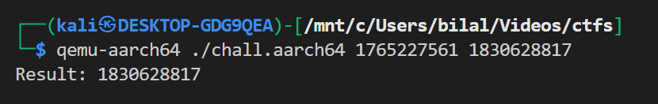
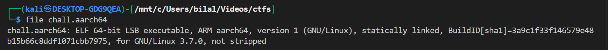
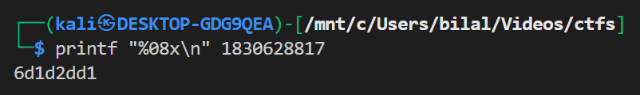

# **ARMssembly 0**

## Description:

**Goal:** What integer does this program print with arguments `1765227561` and `1830628817`?
**Flag format:** `picoCTF{XXXXXXXX}` where `XXXXXXXX` = 32-bit hex, lowercase, zero-padded.

---

## Quick answer (flag)

The program prints `1830628817`.
Convert to 32-bit lowercase hex (8 chars): `6d1d2dd1`.
**Flag:**

```
picoCTF{6d1d2dd1}
```

---

## What the program does (high level)

- The program is AArch64 assembly (`.arch armv8-a`), compiled into an ARM64 ELF.
- It reads `argv[1]` and `argv[2]` (first and second command line arguments), converts them to integers with `atoi`, calls `func1` with those two integers, and prints the returned result with `printf("Result: %ld\n", result)`.
- `func1` returns the **maximum** of its two 32-bit integer arguments.

So overall: `print( max( atoi(argv[1]), atoi(argv[2]) ) )`.

---

## Short analysis of the important assembly parts

### `func1` (pseudocode)

```c
int func1(int a, int b) {
    // It stores and reloads registers, then compares and returns the larger value
    if (b <= a)          // cmp w1, w0 ; bls .L2  (note registers swapped by stores/ldrs)
        return a;
    else
        return b;
}
```

(From the code: it stores `w0`/`w1` on the stack, reloads them reversed, `cmp w1, w0` then `bls` branches — final effect is returning the larger value.)

### `main` (pseudocode)

```c
int main(int argc, char **argv) {
    // prologue: save fp/lr, save x19, argc, argv on stack...
    int a = atoi(argv[1]);   // add x0, x0, 8 ; ldr x0, [x0] ; bl atoi
    int b = atoi(argv[2]);   // similar but +16 for argv[2]
    int res = func1(a, b);   // bl func1
    printf("Result: %ld\n", res);
    return 0;
}
```

Key register usage:

- `x0` initial → `argv` pointer; then `add x0, x0, 8` → `argv + 8` → deref → `argv[1]` pointer → `atoi`.
- second argument retrieved by `add x0, x0, 16` → `argv[2]`.
- results passed in `w0/w1` per AArch64 calling convention.

---

## How to compile & run on an x86 Linux host (with QEMU user emulation)

### Prereqs (Debian/Ubuntu/Kali)

```bash
sudo apt update
sudo apt install -y gcc-aarch64-linux-gnu qemu-user qemu-user-static
```

### Compile (AArch64)

If you want a dynamic binary:

```bash
aarch64-linux-gnu-gcc chall.S -o chall.aarch64
```

If QEMU complains about missing `/lib/ld-linux-aarch64.so.1` (dynamically linked loader), either run with a proper ARM sysroot (`-L`) or build statically:

**Static compile (quick & easiest for CTFs):**

```bash
aarch64-linux-gnu-gcc -static chall.S -o chall.aarch64
```

### Run with QEMU (user-mode)

```bash
qemu-aarch64 ./chall.aarch64 1765227561 1830628817
```

That prints:



(If you built dynamic and see `Could not open '/lib/ld-linux-aarch64.so.1'`, recompile with `-static` or run QEMU with `-L` pointing to an AArch64 sysroot containing the loader.)

---

## Verify binary architecture (optional)



---

## Convert output to picoCTF flag

Decimal printed: `1830628817`.

Convert to 32-bit lowercase hex (zero padded). Two ways:

**BASH printf**

```bash
printf "%08x\n" 1830628817
```



Wrap in `picoCTF{}`:

```
picoCTF{6d1d2dd1}
```

