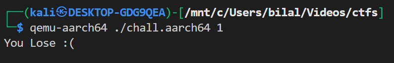
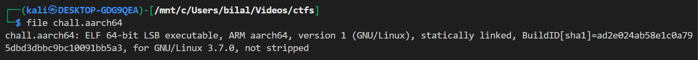
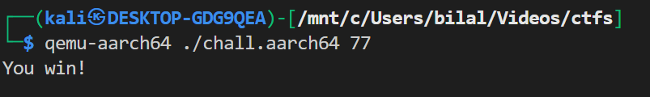
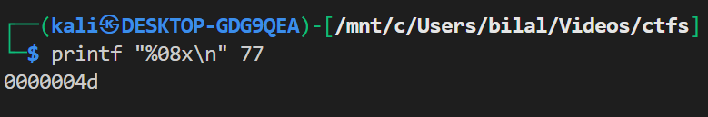

# **ARMssembly 1**

This challange is same as [ARMssembly 0](../43/)

## Description:

We are given an ARMv8 assembly source file (`chall_1.S`). The program prints either:

- `"You win!"`
- or `"You Lose :("`

The task is:
👉 Find the input argument that makes the program print `"You win!"`.

Flag format:

```
picoCTF{XXXXXXXX}
```

where `XXXXXXXX` is the **32-bit hex representation** of the correct integer, lowercase, no `0x`, and padded to 8 digits.

---

## Understanding `main`

Looking at `main`:

```asm
ldr x0, [x29, 16]
add x0, x0, 8
ldr x0, [x0]
bl atoi
str w0, [x29, 44]
ldr w0, [x29, 44]
bl func
cmp w0, 0
bne .L4
```

- It takes the **first command-line argument**,
- converts it to an integer with `atoi`,
- calls `func(arg)`,
- checks if the return value is `0`.

If it **is 0**, the program prints `"You win!"`.

---

## Analyzing `func`

```asm
func:
    sub sp, sp, #32
    str w0, [sp, 12]     // store input

    mov w0, 58
    str w0, [sp, 16]

    mov w0, 2
    str w0, [sp, 20]

    mov w0, 3
    str w0, [sp, 24]

    // compute: (58 << 2)
    ldr w0, [sp, 20]     // w0 = 2
    ldr w1, [sp, 16]     // w1 = 58
    lsl w0, w1, w0       // w0 = 58 << 2 = 232

    str w0, [sp, 28]

    // divide by 3
    ldr w1, [sp, 28]     // w1 = 232
    ldr w0, [sp, 24]     // w0 = 3
    sdiv w0, w1, w0      // w0 = 232 / 3 = 77

    str w0, [sp, 28]

    // subtract input
    ldr w1, [sp, 28]     // w1 = 77
    ldr w0, [sp, 12]     // w0 = input
    sub w0, w1, w0       // result = 77 - input

    ret
```

So mathematically:

```
func(input) = ( (58 << 2) / 3 ) - input
            = (232 / 3) - input
            = 77 - input
```

---

## How to compile & run on an x86 Linux host (with QEMU user emulation)

### Prereqs (Debian/Ubuntu/Kali)

```bash
sudo apt update
sudo apt install -y gcc-aarch64-linux-gnu qemu-user qemu-user-static
```

### Compile (AArch64)

If you want a dynamic binary:

```bash
aarch64-linux-gnu-gcc chall_1.S -o chall.aarch64
```

If QEMU complains about missing `/lib/ld-linux-aarch64.so.1` (dynamically linked loader), either run with a proper ARM sysroot (`-L`) or build statically:

**Static compile (quick & easiest for CTFs):**

```bash
aarch64-linux-gnu-gcc -static chall_1.S -o chall.aarch64
```

### Run with QEMU (user-mode)

```bash
qemu-aarch64 ./chall.aarch64 <no>
```



---

## Verify binary architecture (optional)



---

## Condition for `"You win!"`

We want:

```
func(input) == 0
→ 77 - input == 0
→ input == 77
```



---

## Step 4: Flag Format

We must convert `77` into 32-bit hex (zero-padded, lowercase).



---

## Final Flag

```
picoCTF{0000004d}
```

---
