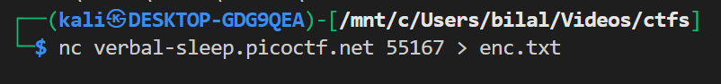
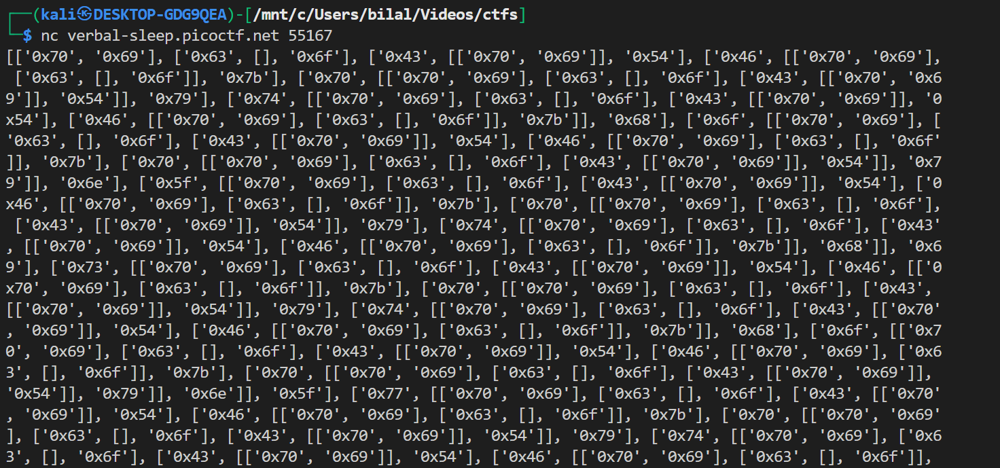
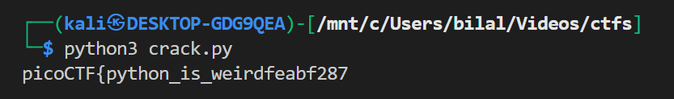

# **Quantum Scrambler**

## **Description:**

> We invented a new cypher that uses "quantum entanglement" to encode the flag. Do you have what it takes to decode it?

We are given a **scrambler** that takes the flag from `flag.txt` and jumbles it into a nested structure.

---

## Understanding the Scrambler

The scrambler code:

```python
def scramble(L):
    A = L
    i = 2
    while (i < len(A)):
        A[i-2] += A.pop(i-1)        # Merge element i-1 into i-2
        A[i-1].append(A[:i-2])      # Append a slice of previous lists
        i += 1
    return L
```

And the flag is first turned into a list of hex characters:

```python
def get_flag():
    flag = open('flag.txt', 'r').read().strip()
    hex_flag = []
    for c in flag:
        hex_flag.append([str(hex(ord(c)))])
    return hex_flag
```

### Example:

If the flag is `"hello"`, the first representation is:

```python
[['0x68'], ['0x65'], ['0x6c'], ['0x6c'], ['0x6f']]
```

After scrambling, it may look like this:

```python
[['0x68', '0x65'], ['0x6c', [], '0x6c'], ['0x6f', [['0x68','0x65']]]]
```

Notice how:

- Lists are merged (`A[i-2] += A.pop(i-1)`).
- Nested junk is added (`A[i-1].append(A[:i-2])`).

The important values are still there, but buried.

---

## Reverse Engineering the Structure

We know:

- The **first element** always keeps 2 valid hex values.
- Later elements may have junk and nesting, but follow a pattern.

The deserialization logic:

```python
for i, current in enumerate(scrambled):
    if i == 0:
        result.extend(current[:2])  # first two hex values are valid
    elif len(current) >= 3:
        result.extend([current[0], current[2]])  # valid chars are first and third
    elif len(current) == 2:
        result.append(current[0])  # only first is valid
```

This logic discards the junk (`[]`, nested lists) and keeps the real hex values.

---

## Converting Back to Text

After reconstructing the hex values, we convert them back:

```python
flag = "".join(
    chr(int(val, 16)) for val in result
    if isinstance(val, str) and val.startswith("0x")
)
```

---

## Example Walkthrough

### Input (`enc.txt`):

```python
[['0x68', '0x65'], ['0x6c', [], '0x6c'], ['0x6f', [['0x68','0x65']]]]
```

### Step 1: Extract values

- First element → `['0x68', '0x65']`
- Second element → `['0x6c', '0x6c']` (skip the empty list)
- Third element → `['0x6f']` (ignore nested junk)

### Step 2: Result list

```python
['0x68', '0x65', '0x6c', '0x6c', '0x6f']
```

### Step 3: Convert to ASCII

```
hello
```

---

# remote:



now the enc.txt file will have some thing like this



now lets run the crack



the final flag is `picoCTF{python_is_weirdfeabf287}`
