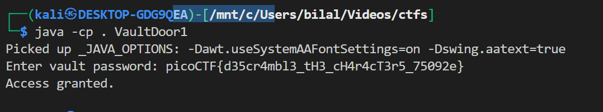

# VaultDoor1

## **Description:**

> This vault uses some complicated arrays! I hope you can make sense of it, special agent. The source code for this vault is here: VaultDoor1.java
---

## Summary

`VaultDoor1.java` reads a user-supplied string in the form `picoCTF{...}`, strips the `picoCTF{` prefix and trailing `}`, then passes the inner string to `checkPassword`. `checkPassword` does a length check (`== 32`) and a sequence of `password.charAt(index) == 'x'` comparisons. The expected flag is therefore reconstructable directly from the source.

---

## Steps & Analysis

1. Compile & run:

```
javac VaultDoor1.java
java -cp . VaultDoor1
```

2. The program reads input like:

```java
String userInput = scanner.next();
String input = userInput.substring("picoCTF{".length(), userInput.length()-1);
```

So the program expects a full flag `picoCTF{<32 chars>}`; `checkPassword` receives only the 32-character inner string.

3. Inspect `checkPassword(String password)`:

* First condition: `password.length() == 32`.
* Then many `password.charAt(i) == 'x'` checks. Each of these gives the exact character required at that index.

4. Reconstruct the inner password by ordering the `charAt` checks from index `0` to `31`. The mapping yields:

```
d35cr4mbl3_tH3_cH4r4cT3r5_75092e
```

5. Compose the full flag:

```
picoCTF{d35cr4mbl3_tH3_cH4r4cT3r5_75092e}
```

6. Verify by running the program and entering that string — it prints:



---

## Final Flag

`picoCTF{d35cr4mbl3_tH3_cH4r4cT3r5_75092e}`

---

