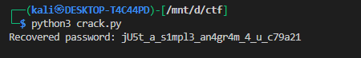

# **vault-door-3**

## Description:

> This vault uses for-loops and byte arrays. The source code for this vault is here: VaultDoor3.java

We’re given a Java program that checks a password for the vault.
The key logic lies in the `checkPassword` method:

```java
public boolean checkPassword(String password) {
    if (password.length() != 32) return false;
    char[] buffer = new char[32];
    int i;

    // Copy first 8 chars directly
    for (i=0; i<8; i++) {
        buffer[i] = password.charAt(i);
    }

    // Shuffle chars in positions [8,15]
    for (; i<16; i++) {
        buffer[i] = password.charAt(23-i);
    }

    // Shuffle chars in even positions [16,30]
    for (; i<32; i+=2) {
        buffer[i] = password.charAt(46-i);
    }

    // Copy chars in odd positions [17,31]
    for (i=31; i>=17; i-=2) {
        buffer[i] = password.charAt(i);
    }

    String s = new String(buffer);
    return s.equals("jU5t_a_sna_3lpm12g94c_u_4_m7ra41");
}
```

At the end, the scrambled string must equal:

```
jU5t_a_sna_3lpm12g94c_u_4_m7ra41
```

So the code *scrambles* the input password and then checks if it matches the target string.
Our goal is to **reverse this scrambling** to recover the original password.

---

## Step-by-Step Analysis

1. **First loop** (`i=0..7`):
   `buffer[i] = password.charAt(i)`
   → First 8 characters stay in place.

2. **Second loop** (`i=8..15`):
   `buffer[i] = password.charAt(23 - i)`
   → Maps password indices `15..8` into buffer `8..15`.

3. **Third loop** (`i=16..30 step 2`):
   `buffer[i] = password.charAt(46 - i)`
   → Places password indices `30..16` into buffer positions `16..30` (even only).

4. **Fourth loop** (`i=31..17 step -2`):
   `buffer[i] = password.charAt(i)`
   → Odd indices remain unchanged.

Finally, `buffer` is compared against the scrambled string.

---

## Python Script to Reverse

We simulate the **inverse mapping**: for each assignment in Java, we rewrite it as `password[...] = scrambled[...]`.

```python
scrambled = "jU5t_a_sna_3lpm12g94c_u_4_m7ra41"

def recover(scrambled):
    password = ['?'] * 32

    # 1) buffer[i] = password[i]
    for i in range(0, 8):
        password[i] = scrambled[i]

    # 2) buffer[i] = password[23 - i]
    for i in range(8, 16):
        password[23 - i] = scrambled[i]

    # 3) buffer[i] = password[46 - i]
    for i in range(16, 32, 2):
        password[46 - i] = scrambled[i]

    # 4) buffer[i] = password[i]
    for i in range(31, 16, -2):
        password[i] = scrambled[i]

    return "".join(password)

print("Recovered password:", recover(scrambled))
```

---

## Output



so the flag would be `picoCTF{jU5t_a_s1mpl3_an4gr4m_4_u_c79a21}`

