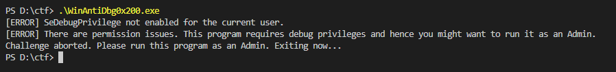
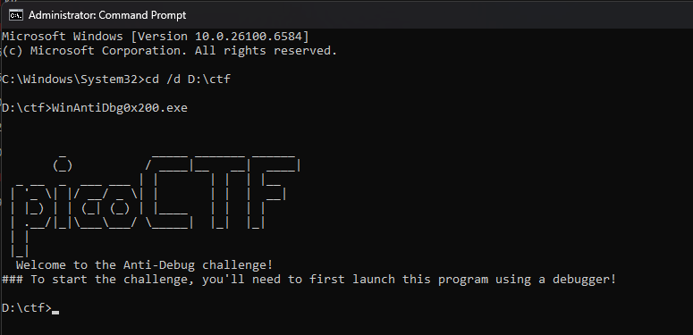
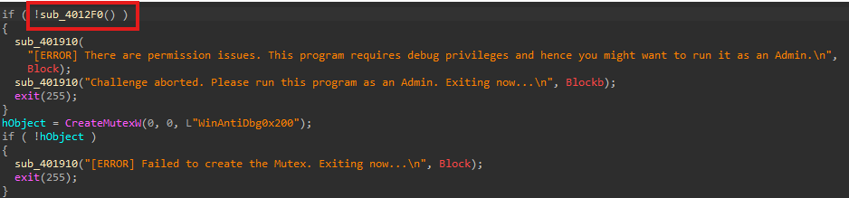
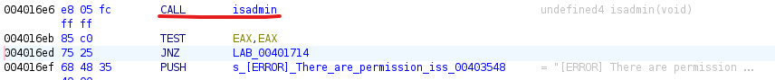
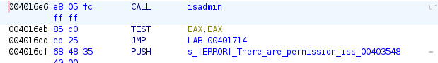
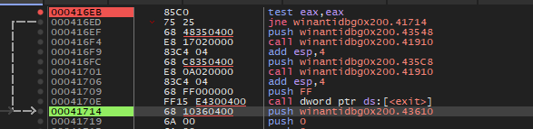
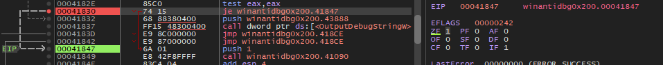
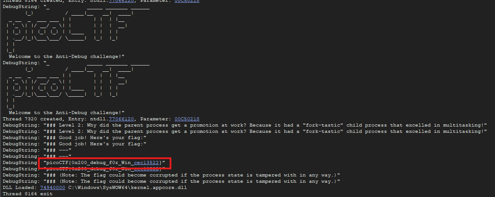

# **WinAntiDbg0x200**

This challange is similar to [WinAntiDbg0x200](../4/)

We were given a program that only run when it is run using a debugger & also with admin privileges

### Description

> If you have solved WinAntiDbg0x100, you'll discover something new in this one. Debug the executable and find the flag!
This challenge executable is a Windows console application, and you can start by running it using Command Prompt on Windows.
This executable requires admin privileges. You might want to start Command Prompt or your debugger using the 'Run as administrator' option.

so i will use `x32dbg` with `Ghidra` & `IDA`

first of all we will patch the admin problem

this is the function that cheaks if we have admin privileges i renamed it to `isadmin()`

we can see that to make it by pass admin cheak we need to jump using  `JNZ  LAB_0040171`

- If isadmin() returns 1 (true) → EAX=1 → ZF=0 → JNZ is taken → jumps.
- If isadmin() returns 0 (false) → EAX=0 → ZF=1 → no jump.

there are many ways we can patch it and the mpost easiest is to simply make the `jne` instruction into `jmp`

we can also have toggled the value of `zero flag` to `0` to bypass it 

now we have patched the admin cheack 

now we have to bypass the IsDebuggerPresent() function it is also simple as this 

it is same as of WinAntiDbg0x100

