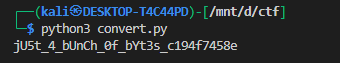

# **vault-door-4**

## Description:

> This vault uses ASCII encoding for the password. The source code for this vault is here: VaultDoor4.java

We’re given a Java program `VaultDoor4`.
The program asks the user for a password and checks it by comparing its bytes against a predefined array `myBytes`.

Here’s the important part:

```java
byte[] myBytes = {
    106 , 85  , 53  , 116 , 95  , 52  , 95  , 98  ,
    0x55, 0x6e, 0x43, 0x68, 0x5f, 0x30, 0x66, 0x5f,
    0142, 0131, 0164, 063 , 0163, 0137, 0143, 061 ,
    '9' , '4' , 'f' , '7' , '4' , '5' , '8' , 'e' ,
};
```

The program then does:

```java
for (int i=0; i<32; i++) {
    if (passBytes[i] != myBytes[i]) {
        return false;
    }
}
```

So the password must **exactly match** the contents of `myBytes`.
The trick: `myBytes` is written using a mix of **decimal, hexadecimal, octal, and character literals**.

---

### Decode `myBytes`

Let’s break it down:

1. **Decimal literals**: e.g., `106 → 'j'`, `85 → 'U'`
2. **Hexadecimal literals** (`0x`): `0x55 → 'U'`, `0x6e → 'n'`
3. **Octal literals** (`0o` in Python, `0` prefix in Java):

   * `0142 (octal) = 98 decimal = 'b'`
   * `0131 = 89 decimal = 'Y'`
   * `0164 = 116 decimal = 't'`
   * `063 = 51 decimal = '3'`
   * `0163 = 115 decimal = 's'`
   * `0137 = 95 decimal = '_'`
   * `0143 = 99 decimal = 'c'`
   * `061 = 49 decimal = '1'`
4. **Character literals**: e.g., `'9'`, `'f'`, `'e'`

---

### Python Script to Convert

```python
myBytes = [
    106 , 85  , 53  , 116 , 95  , 52  , 95  , 98  ,
    0x55, 0x6e, 0x43, 0x68, 0x5f, 0x30, 0x66, 0x5f,
    0o142, 0o131, 0o164, 0o63 , 0o163, 0o137, 0o143, 0o61 ,
    ord('9') , ord('4') , ord('f') , ord('7') , ord('4') , ord('5') , ord('8') , ord('e')
]

converted = ''.join([chr(b) for b in myBytes])
print(converted)
```

**Output:**



---

### Final Flag

The program strips `"picoCTF{"` and `"}"` before checking, so the full flag is:

```
picoCTF{jU5t_4_bUnCh_0f_bYt3s_c194f7458e}
```

---

