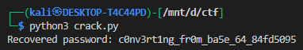
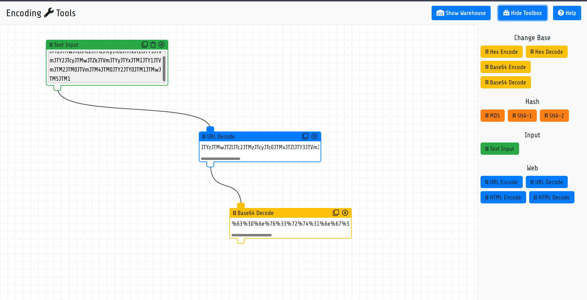
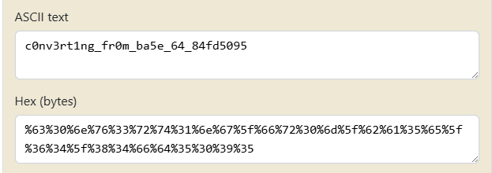

# **vault-door-5**


## Description:

> In the last challenge, you mastered octal (base 8), decimal (base 10), and hexadecimal (base 16) numbers, but this vault door uses a different change of base as well as URL encoding! The source code for this vault is here: VaultDoor5.java


The Java class `VaultDoor5` implements a vault password check. The goal is to recover the correct password that passes the `checkPassword()` function. Let’s analyze step by step.

---

### **Password Verification Logic**

The key function is:

```java
public boolean checkPassword(String password) {
    String urlEncoded = urlEncode(password.getBytes());
    String base64Encoded = base64Encode(urlEncoded.getBytes());
    String expected = "JTYzJTMwJTZlJTc2JTMzJTcyJTc0JTMxJTZlJTY3JTVm..."
    return base64Encoded.equals(expected);
}
```

**Steps performed on the password:**

1. **URL Encoding (`urlEncode`)**

```java
for (int i=0; i<input.length; i++) {
    buf.append(String.format("%%%2x", input[i]));
}
```

* Each byte of the password is converted to **hexadecimal** using `%2x`.
* A literal percent sign (`%`) is prepended to each hex value.
* Example:

  ```java
  'A' → 65 (decimal) → 41 (hex) → "%41"
  'B' → 66 → 42 → "%42"
  ```
* So, `"AB"` → `"%41%42"`

---

2. **Base64 Encoding**

```java
Base64.getEncoder().encodeToString(urlEncoded.getBytes());
```

* After URL encoding, the result is **converted to bytes** and then **Base64-encoded**.
* Base64 maps binary data to ASCII characters: `A-Z, a-z, 0-9, +, /`.

---

3. **Comparison**

* The final Base64 string is compared against a known value:

```
JTYzJTMwJTZlJTc2JTMzJTcyJTc0JTMxJTZlJTY3JTVm...
```

---

### **Approach to Recover the Password**

We need to **reverse the transformations**:

1. **Base64 decode** the `expected` string → get the URL-encoded string.
2. **URL decode** the result → get the original password.

---

### **Python Exploit Script**

Here’s a Python script to recover the password:

```python
import base64
import urllib.parse

# Step 1: the expected Base64 string from Java
expected = ("JTYzJTMwJTZlJTc2JTMzJTcyJTc0JTMxJTZlJTY3JTVm"
            "JTY2JTcyJTMwJTZkJTVmJTYyJTYxJTM1JTY1JTVmJTM2"
            "JTM0JTVmJTM4JTM0JTY2JTY0JTM1JTMwJTM5JTM1")

# Step 2: Base64 decode → URL-encoded string
url_encoded_bytes = base64.b64decode(expected)
url_encoded_str = url_encoded_bytes.decode()

# Step 3: URL decode → original password
password = urllib.parse.unquote(url_encoded_str)

print("Recovered password:", password)
```

---

### **How it Works**

* `base64.b64decode()` reverses the Base64 encoding.
* `urllib.parse.unquote()` reverses the URL encoding:
  `%41 → 'A'`, `%42 → 'B'`, etc.

The output of this script is the **plaintext password** you can use in the vault.




---

### **Using encoding.tools**


we can also use [encoding.tools](https://encoding.tools/) it makes it easy to do 




we then have to just convert the hex to ascii




so our final flag will be `picoCTF{c0nv3rt1ng_fr0m_ba5e_64_84fd5095}`


---

