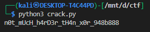

# **vault-door-6**

### **Description**

> This vault uses an XOR encryption scheme. The source code for this vault is here: VaultDoor6.java

The Java program `VaultDoor6` is a “vault door” that checks a 32-character password. The key part of the code is the `checkPassword` function:

```java
for (int i=0; i<32; i++) {
    if (((passBytes[i] ^ 0x55) - myBytes[i]) != 0) {
        return false;
    }
}
```

---

### **Understanding the Password Check**

1. `passBytes[i] ^ 0x55` — Each byte of the entered password is **XORed with `0x55`**.
2. The result is then compared to the corresponding value in `myBytes`:

```java
(passBytes[i] ^ 0x55) == myBytes[i]
```

3. If all 32 bytes match, the password is correct.

So, mathematically, to recover the original password:

$$
\text{passBytes}[i] = \text{myBytes}[i] \oplus 0x55
$$

---

### **Reversing the XOR**

The XOR operation is **reversible**. Applying XOR again with the same key (`0x55`) recovers the original value:

```python
original_byte = myBytes[i] ^ 0x55
```

---

### **Implementation in Python**

```python
myBytes = [
    0x3b, 0x65, 0x21, 0x0a, 0x38, 0x00, 0x36, 0x1d,
    0x0a, 0x3d, 0x61, 0x27, 0x11, 0x66, 0x27, 0x0a,
    0x21, 0x1d, 0x61, 0x3b, 0x0a, 0x2d, 0x65, 0x27,
    0x0a, 0x6c, 0x61, 0x6d, 0x37, 0x6d, 0x6d, 0x6d,
]

def get_pass(bytes_arr):
    password = ""
    for b in bytes_arr:
        password += chr(b ^ 0x55)  # XOR with 0x55 to recover original
    return password

password = get_pass(myBytes)
print("Recovered password:", password)
```

---

### **Explanation of the Python Code**

1. The `myBytes` array is the same as in the Java program.
2. We iterate over each byte.
3. For each byte, we XOR it with `0x55` to reverse the encryption.
4. We convert each byte to a character with `chr()`.
5. Finally, we join all characters to get the full password.

---

### **Key Takeaways**

* XOR is **reversible**: `A ^ B ^ B = A`.
* When a program stores “encrypted” bytes using XOR, you can recover the original by XORing again with the same key.
* Always check whether numbers are in **hex (`0x`), octal (`0o`), or decimal** when reversing.

---

### **Output**




so the final flag would be `picoCTF{n0t_mUcH_h4rD3r_tH4n_x0r_948b888}`