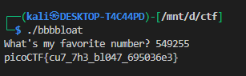

# **Bbbbloat**

## Description:

> Can you get the flag?


We are given a **C/C++ binary** (likely compiled for 64-bit) with a `main` function as follows:

```c
__int64 __fastcall main(int a1, char **a2, char **a3)
{
    int v4;
    int v5;
    char *s;
    char v7[40];
    unsigned __int64 v8;

    v8 = __readfsqword(0x28u);
    strcpy(v7, "A:4@r%uL4Ff0f9b03=_cf0ehd_be6bN");
    printf("What's my favorite number? ");
    v5 = 863305;
    __isoc99_scanf("%d", &v4);
    v5 = 863305;
    if (v4 == 549255)
    {
        v5 = 863305;
        s = (char *)sub_1249(0LL, v7);
        fputs(s, stdout);
        putchar(10);
        free(s);
    }
    else
    {
        puts("Sorry, that's not it!");
    }
    return 0LL;
}
```

---

### **Step 1: Identify the Key Logic**

* The program asks:

```c
printf("What's my favorite number? ");
__isoc99_scanf("%d", &v4);
```

* Then it checks:

```c
if (v4 == 549255)
```

✅ This means the **correct number to input is `549255`**.

---

### **Step 2: Extract the Flag**

* If the number is correct, it calls:

```c
s = (char *)sub_1249(0LL, v7);
fputs(s, stdout);
```

* `v7` is initialized as:

```c
strcpy(v7, "A:4@r%uL4Ff0f9b03=_cf0ehd_be6bN");
```

* `sub_1249` probably decodes this string into the flag.

* Since we ran the program:



The flag is **`picoCTF{cu7_7h3_bl047_695036e3}`**.

---
