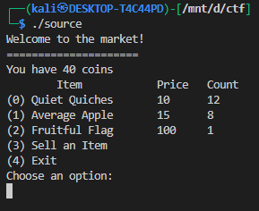
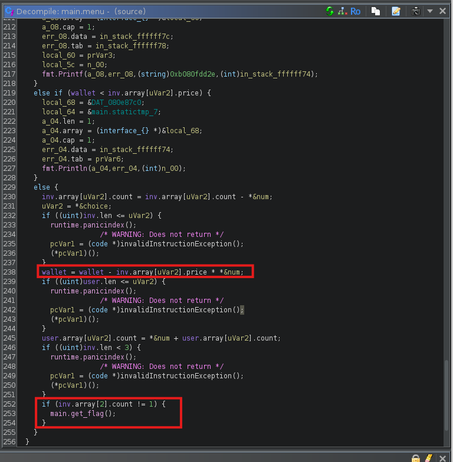
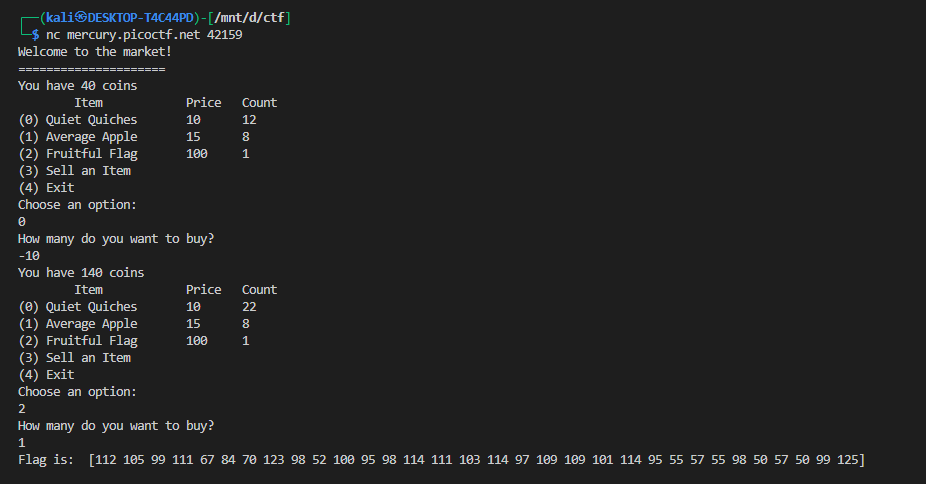
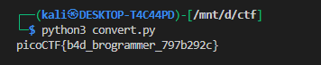

# **Shop**


## Description:

> Best Stuff - Cheap Stuff, Buy Buy Buy... Store Instance: source. The shop is open for business at nc mercury.picoctf.net 42159.

**Challenge type:** binary reversing / exploitation (menu-driven Go program)
**Goal:** make the program call `main.get_flag()` so it prints the flag.

---

## Summary

The program fails to validate the *quantity* a user inputs when buying items; supplying **negative buy amounts** increases your wallet and changes inventory counts. By abusing that, we change the store’s `Fruitful Flag` item count from `1` to `!= 1`, which causes the program to call `get_flag()` and print the flag bytes.

---

## What the program does (relevant parts)

* Prints a market menu with 3 items:

  

* Buying an item executes (conceptual):

  

  ```go
  inv[choice].count = inv[choice].count - num
  wallet = wallet - inv[choice].price * num
  user[choice].count += num
  ```

  **No check** that `num` is positive before doing arithmetic.

* Later, after a successful purchase:

  ```go
  if inv[2].count != 1 {
      main.get_flag()
  }
  ```

  So changing `inv[2].count` away from `1` triggers `get_flag()`.

* `main.get_flag()` reads a file and prints its bytes (the flag).

---

## The vulnerability

The program assumes `num` (the purchase quantity) is positive but **never validates its sign**. Thus:

* If `num` is negative, `-price * num` becomes positive → wallet **increases**.
* `inv[count] = inv[count] - num` with negative `num` **increases** the store count.

This permits arbitrary manipulation of wallet and inventory counts to satisfy the `get_flag()` condition.

---

## Exploit (exact, reproducible steps)

Run the binary and follow this input sequence (interactive, exact lines to type):



### Convert printed bytes → ASCII

The program prints the flag bytes as decimals. Convert them:


```python
arr = [112 ,105 ,99 ,111 ,67 ,84 ,70 ,123, 98 ,52 ,100 ,95 ,98 ,114 ,111 ,103 ,114 ,97 ,109, 109, 101, 114, 95, 55, 57, 55, 98, 50, 57, 50, 99, 125]
print(''.join(chr(x) for x in arr)) 
```

So the flag (CTF format) is:




---

## Why this works (brief)

* Buying `-1` of item `0` does:

  * `inv[0].count = inv[0].count - (-1)` → `count + 1`
  * `wallet = wallet - price * (-1)` → `wallet + price`
* Repeating with `-10` escalates the effect.
* With increased wallet and corrupted user inventory counts, a later purchase/sell sequence causes the code path that checks `inv[2].count` to see it not equal to `1`, so `main.get_flag()` executes.

---

## How `get_flag()` behaves

Decompiled pseudocode shows `get_flag()` does:

```go
dat, err := ioutil.ReadFile("<embedded-file-path>")
check(err)
fmt.Println(dat)   // prints bytes array
os.Exit(0)
```

So it prints the raw bytes of the file read (the flag), then exits.

---

