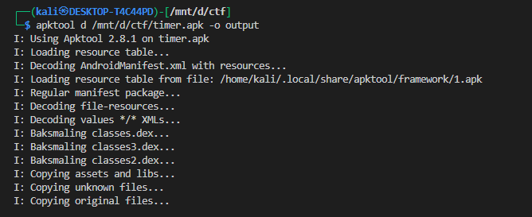
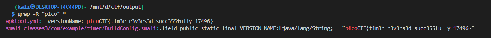
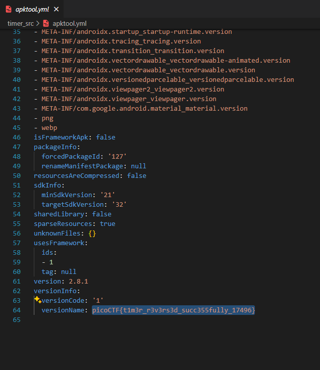
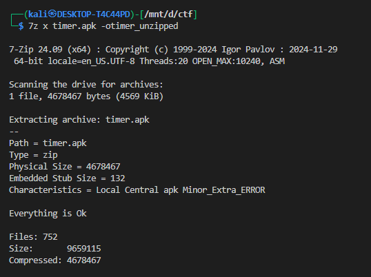
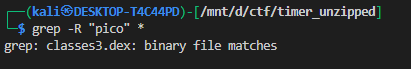
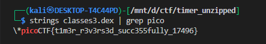
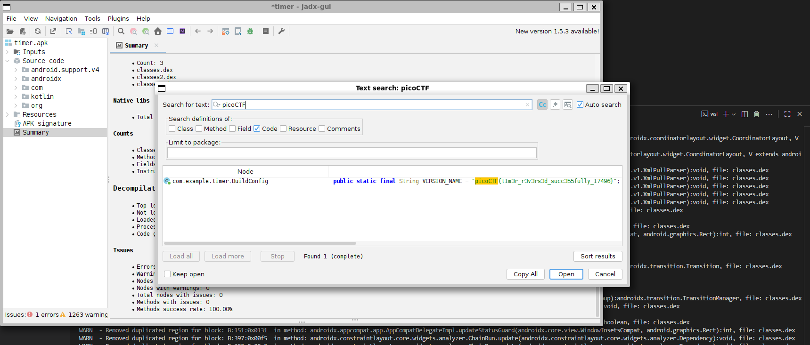

# **Timer**

## Description:

> You will find the flag after analysing this apk

---

## **Understand the file**

The challenge provided a `timer.apk` file.

To analyze them, you can use:

* **`strings`** – quick way to search for readable text in the binary.
* **[jadx-gui](https://github.com/skylot/jadx.git)** – to decompile the `apk` into readable code.
* **[apktool](https://apktool.org/)** – for full APK analysis (if needed).
* **[7-Zip](https://www.7-zip.org/)** – for unziping the apk files

---

## **apktool**

Using `apktool` on Linux:

```bash
apktool b timer.apk -o output
```

Output:



this will create an folder name output 

lets use `grep` to find the flag here



we got the flag in two files




---

## **7-zip (Alternative approach)**


APK-files are simply a Zip-file and can be unpacked with a tool such as [7-Zip](https://www.7-zip.org/).



this will create an folder name timer_unzipped

now we will look into it for flag also using grep





we found one file having this we will use strings to get tghe flag




---

## **jadx (Alternative approach)**

we can also use jadx to find the flag 

Since the APK-file contains a lot of files, the fastest way to find the flag is to use the 'Text search' feature.
It is available both in the Navigation-menu and as a button on the tool bar.




