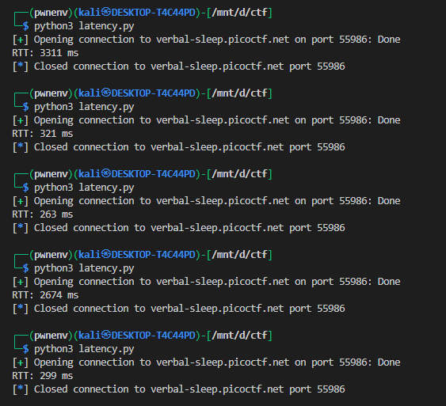
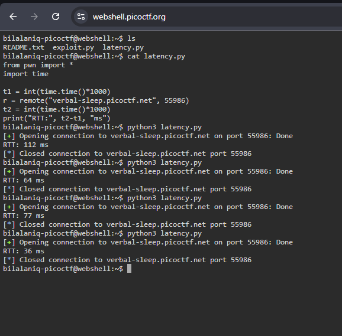
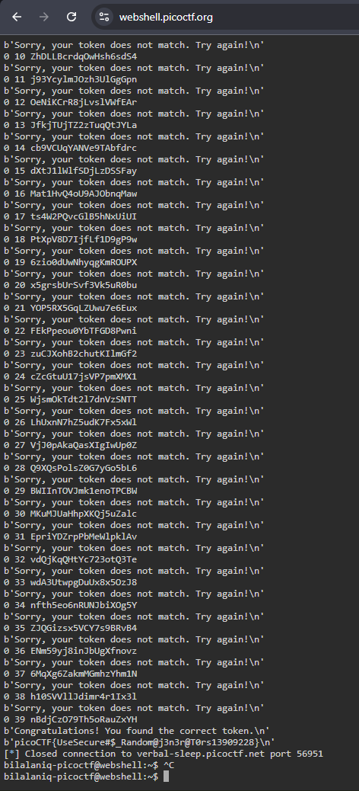

# **Chronohack**

## Description

> Can you guess the exact token and unlock the hidden flag?
Our school relies on tokens to authenticate students. Unfortunately, someone leaked an important file for token generation. Guess the token to get the flag.
Additional details will be available after launching your challenge instance.

### HINTS

>https://www.epochconverter.com/

>https://learn.snyk.io/lesson/insecure-randomness/

>Time tokens generation

>Generate tokens for a range of seed values very close to the target time


The challenge provides a Python program that generates a 20-character random token based on the current time in milliseconds and asks the user to guess it:

```python
token = get_random(20)  # Uses random.seed(time.time()*1000)
```

```python
def get_random(length):
    alphabet = "0123456789ABCDEFGHIJKLMNOPQRSTUVWXYZabcdefghijklmnopqrstuvwxyz"
    random.seed(int(time.time() * 1000))  # seeding with current time 
    s = ""
    for i in range(length):
        s += random.choice(alphabet)
    return s
```

The user has **50 attempts** to guess the token. If the correct token is guessed, the flag is revealed.

## Challenge Analysis

The program uses Python’s `random` module seeded with the current timestamp in milliseconds:

```python
random.seed(int(time.time() * 1000))
```

This makes the token **predictable** if we can approximate the server’s current time. The main points:

1. **Token Length:** 20 characters.
2. **Character Set:** `0-9`, `A-Z`, `a-z`.
3. **Token Generation:** Uses `random.choice` with a seed of current milliseconds.
4. **Attempts Limit:** 50 per connection.

Because the token is generated from the **current time**, an attacker can **brute-force nearby timestamps** to generate candidate tokens.

---

## Exploit Strategy

1. **Approximate the Server Time:** Measure **latency** using a network connection to estimate the round-trip delay.
2. **Generate Candidate Tokens:** Use Python’s `random` module with timestamps around the estimated server time.
3. **Send Tokens:** Attempt 50 tokens per connection.
4. **Offset Handling:** After exhausting 50 attempts, increment the timestamp offset by \~50 ms to cover the next batch of possible seeds.
5. **Repeat Until Success:** Continue until the correct token is found.

---

## Measuring Latency

To account for network delay, we calculate the round-trip time (RTT) between our client and the server:

```python
from pwn import *
import time

t1 = int(time.time()*1000)
r = remote("verbal-sleep.picoctf.net", 56951)
t2 = int(time.time()*1000)
print("RTT:", t2-t1, "ms")
```

* **RTT** is the total round-trip delay.
* Estimated **one-way latency** ≈ RTT / 2.
* This helps approximate the server’s token generation timestamp.



i know what you are gona say do i live on the moon 🥲


thanks fully picoctf also give an [webshell](https://webshell.picoctf.org/)

other wise it would have taken a lot of time to guess the right no on my local machine



now thats good it will work

---

## Exploit Code

Here is a full Python exploit using the pwn library:

```python
from pwn import *
import random
import time

def get_random(length, seed):
    alphabet = "0123456789ABCDEFGHIJKLMNOPQRSTUVWXYZabcdefghijklmnopqrstuvwxyz"
    random.seed(seed)
    return ''.join(random.choice(alphabet) for _ in range(length))

def main():
    token_length = 20
    offset = 0

    while True:
        # Estimate seed based on current time + offset
        seed = int(time.time() * 1000 + offset)
        r = remote("verbal-sleep.picoctf.net", 63058)
        token = get_random(token_length, seed)

        n = 0
        while n < 50:
            try:
                r.recvuntil(b"Enter your guess for the token (or exit):")
                r.sendline(token.encode())
                print(offset, n, token)
                ans = r.recvline()
                if b"Congratulations" in ans:
                    print(ans)
                    ans = r.recvline()
                    print(ans)  # This line contains the flag
                    return
                seed += 1
                token = get_random(token_length, seed)
                n += 1
            except KeyboardInterrupt:
                print("\nExiting...")
                return

        # Increment offset by ~50 ms after exhausting 50 attempts
        offset += 50

if __name__ == "__main__":
    main()
```

50 attempts per connection: You can only guess 50 tokens in one connection. But the server's seed keeps advancing as time passes, so your next batch of 50 tokens may need a slightly later seed.

So basically, offset += 50 helps synchronize your guesses with the server’s moving time-based seed without losing any chances.


you may have to run it multiple times to get the flag


---

## Key Points

1. **Predictable RNG:** Python’s `random.seed(time)` is predictable if you know or approximate the seed.
2. **Offset Iteration:** Because only 50 attempts per connection are allowed, incrementing the offset ensures we cover all possible timestamps.
3. **Latency Awareness:** Network latency is critical to correctly guess the server’s seed.
4. **No Brute Force of Full Range:** Instead of brute-forcing all possibilities, we only try timestamps around the approximate current time.

---


