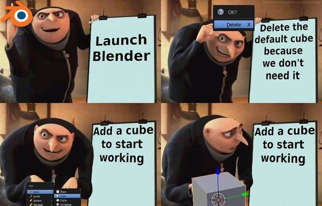

# **Virtual Machine 0**

## Description

> Can you crack this black box?
We grabbed this design doc from enemy servers: Download. We know that the rotation of the red axle is input and the rotation of the blue axle is output. The following input gives the flag as output: Download.

### HINTS

> Rotating the axle that number of times is obviously not feasible. Can you model the mathematical relationship between red and blue?

when we extract the `.zip` file we were given with an `.dae` file 

A .dae file stands for Collada (COLLAborative Design Activity) file. It's a type of 3D model file used to store digital assets like 3D models, animations, textures, and scene information in a standard XML format.


**Contains:**

- Meshes (3D geometry)

- Textures and materials

- Skeletal animations

- Scene hierarchy (how objects are arranged)

Think of .dae as a universal 3D file format for exchanging 3D content between applications.


first thing first use strings to see if the flag is hardcoded or not 


well i donot have [blender](https://www.blender.org/) so we will use [3dviewer.net](https://3dviewer.net/index.html#) to open the file in 3d view


once open you will see the shit i used to make in blender but instead of donot it is an box




We know that the rotation of the red axle is input and the rotation of the blue axle is output.

```bash
39722847074734820757600524178581224432297292490103995897672826024691504153
```

this is the rotation of bigger axil(red axle) which is ther input 


it has total of `40` edges 


so we know that blue axle is output.


it has an total of `8` edges 

So if we want to rotate the blue wheel we have to rotate the red wheel 5 times (40/8 = 5)

Here’s why:

* **Red axle (input):** 40 edges
* **Blue axle (output/small axle):** 8 edges

The **gear ratio** determines how many rotations of the input are needed to rotate the output once:

$$
\text{Rotations of red axle} \times 40 = \text{Rotations of blue axle} \times 8
$$

For **1 rotation of the blue axle**:

$$
\text{Red rotations} = \frac{8}{40} = \frac{1}{5}
$$

This means **1 rotation of the red axle only turns the blue axle 1/5 of a rotation**.

So, to make the **blue axle rotate fully once**, the red axle must rotate:

$$
\text{Red rotations} = 5
$$

💡 In short: **smaller axles turn faster, so you need more rotations of the bigger/red axle to rotate the smaller/blue axle fully.**


so here is an python script that does this and print the flag

```python
input_num = 39722847074734820757600524178581224432297292490103995897672826024691504153

# Multiply by 5 (or whatever operation)
output_num = input_num * 5

# Convert to hex string and remove '0x'
hex_string = hex(output_num)[2:]

# Ensure even length
if len(hex_string) % 2 != 0:
    hex_string = '0' + hex_string

# Convert to ASCII (ignore non-ASCII bytes)
flag = bytes.fromhex(hex_string).decode('ascii', errors='ignore')

print(flag)
```


