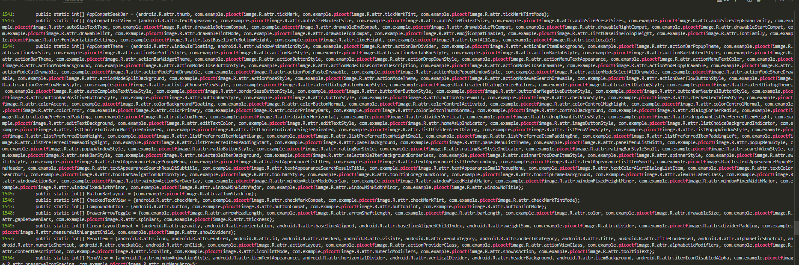
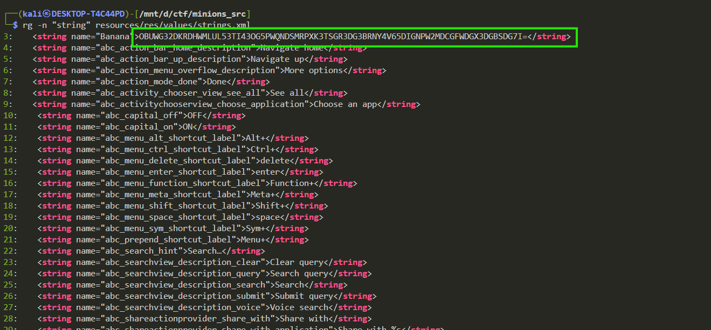
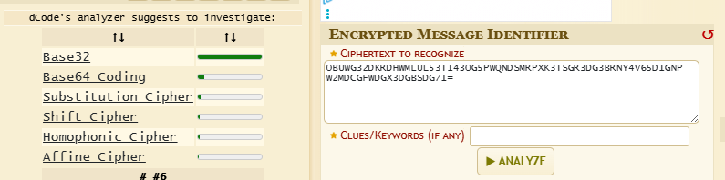
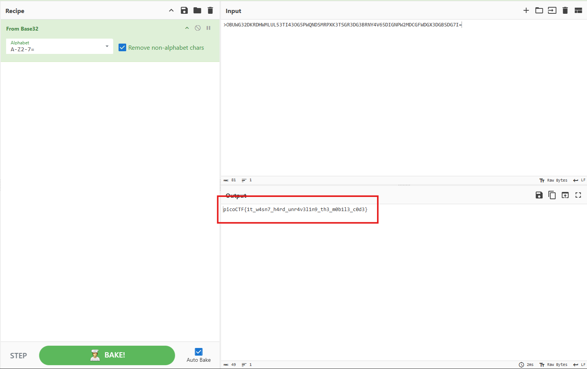

# *Minions* (M1n10n'5_53cr37)

## Description:

> Get ready for a mischievous adventure with your favorite Minions! 🕵️‍♂️💥 They’ve been up to their old tricks, and this time, they've hidden the flag in a devious way within the Android source code. Your task is to channel your inner Minion and dive into the disassembled or decompiled code. Watch out, because these little troublemakers have hidden the flag in multiple sneaky spots or maybe even pulled a fast one and concealed it in the same location!
 
> Put on your overalls, grab your magnifying glass, and get cracking. The Minions have left clues, and it's up to you to follow their trail and uncover the flag. Can you outwit these playful pranksters and find their secret? Let the Minion mischief begin!

## HINTS:

> Do you know how to disassemble an apk file?

> Any interesting source files? 

---

## Summary 

The flag was hidden inside the decompiled APK as a Base32-encoded string. I located the encoded candidate in the decompiled output, decoded it with a Base32 decoder, and recovered the flag:

**Flag:** `picoCTF{1t_w4sn7_h4rd_unr4v3l1n9_th3_m0b1l3_c0d3}`

---

## Environment / tools used

* Kali Linux (terminal only, no GUI)
* `jadx` (CLI) — decompile APK to Java sources
* [ripgrep](https://github.com/BurntSushi/ripgrep.git) (`rg`) — fast text search
* [cipher-identifier](https://www.dcode.fr/cipher-identifier)
* [CyberChef](https://gchq.github.io/CyberChef/)

---

## Steps (reproducible)

1. **Decompile APK**

   ```bash
   # produce decompiled tree (sources + resources)
   jadx -d minions_src minions.apk
   ```
   > note that the jadx works only with absolute path not on relative path 

   so the correct command will be 

   ```bash
   sudo jadx -d /mnt/d/ctf/minions_src /mnt/d/ctf/minions.apk
   ```

   i am using wsl thats why the path look like this 

2. **Limit search to app package and resources (skip AndroidX / Kotlin noise)**

   ```bash
   cd minions_src
   rg -n --hidden -S "picoCTF|picoctf|CTF|flag|FLAG" sources resources
   # returned only package/style references, no plain flag
   ```

   

   well there is no flag hardcoded 🥲

3. **Search for strings in resources/res/values/strings.xml**
   

   ```bash
   rg -n "string" resources/res/values/strings.xml
   ```

   

   One of the candidates printed was:

   ```
   OBUWG32DKRDHWMLUL53TI43OG5PWQNDSMRPXK3TSGR3DG3BRNY4V65DIGNPW2MDCGFWDGX3DGBSDG7I=
   ```

4. **Identify encoding**
   The character set (`A–Z2–7` and trailing `=`) indicated **Base32** (RFC 4648) rather than Base64.

   we can cheak this using [cipher-identifier](https://www.dcode.fr/cipher-identifier) 

   

5. **Decode the Base32 string**

  we can use [CyberChef](https://gchq.github.io/CyberChef/) to decode this 

  

