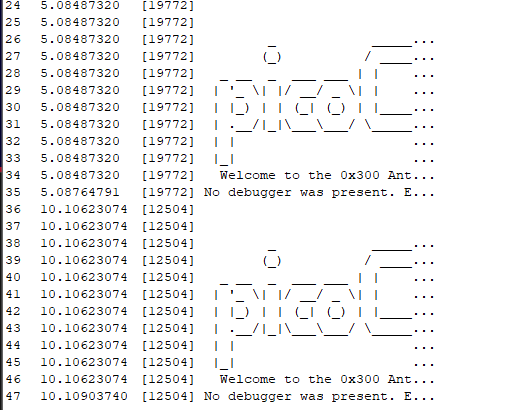

# **WinAntiDbg0x300**

this challange is the some how same as [WinAntiDbg0x200](../5/) & [WinAntiDbg0x200](../4/)


### Description

> This challenge is a little bit invasive. It will try to fight your debugger. With that in mind, debug the binary and get the flag!
This challenge executable is a GUI application and it requires admin privileges. And remember, the flag might get corrupted if you mess up the process's state.

We were given a program that only run when it is run using a debugger & also with admin privileges





so i will use `Ghidra`  & also [debugview](https://learn.microsoft.com/en-us/sysinternals/downloads/debugview)


first of all we need to unpack the binary 


here we can see that the binary is packed using [upx](https://github.com/upx/upx.git)

we can unpack it using 


lets load it in ghidra and patch it 


the challange also give us with `Program Database file (pdb)` which is an gift. It’s a file generated by Microsoft compilers (like MSVC) that contains debugging and project state information for a program.

we can load it to make the debuuging easy 


because this is an gui application so it will contain `Winmain` instead of main

heres the source code of Winmain


```c
int __cdecl wWinMain(HINSTANCE hInstance, HINSTANCE hPrevInstance, wchar_t *lpCmdLine, int nCmdShow)
{
    // 1. Print banner
    PrintDbgBanner();

    // 2. Load strings (window title + class)
    LoadStringW(hInstance, 0x67, szTitle, 200);
    LoadStringW(hInstance, 0x6D, szWindowClass, 200);

    // 3. Read configuration
    if (ReadConfig() == 0) {
        MessageBoxW(appWindow, 
            L"[FATAL ERROR] Error opening the 'config.bin' file. Challenge aborted.", 
            szTitle, MB_ICONERROR);
        Terminate(0xFF);
    }

    // 4. Integrity / hash checks
    ComputeHash(3);

    // 5. Anti-debug check
    if (DetectDebuggerAtLaunch()) {
        MessageBoxW(appWindow, 
            L"Oops! Debugger Detected. Challenge Aborted.", 
            szTitle, MB_ICONWARNING);
        Terminate(0xFF);
    }

    // 6. More hash checks
    ComputeHash(2);

    // 7. Enable debug privilege (maybe needed for process tricks)
    EnableDebugPrivilege();

    // 8. More hash checks
    ComputeHash(2);

    // 9. Parse command-line arguments
    LPWSTR cmdLine = GetCommandLineW();
    int argc;
    LPWSTR *argv = CommandLineToArgvW(cmdLine, &argc);

    // 10. Manage child process
    ManageChildProcess(argc, argv);

    // 11. Register window class & create instance
    MyRegisterClass(hInstance);
    if (InitInstance(hInstance, nCmdShow) == 0) {
        return 0;
    }

    // 12. Load accelerators & create challenge thread
    HACCEL hAccel = LoadAcceleratorsW(hInstance, (LPCWSTR)0x6B);
    HANDLE hThread = CreateThread(NULL, 0, ChallengeThreadFunction, NULL, 0, NULL);

    if (hThread == NULL) {
        MessageBoxW(appWindow, 
            L"Error creating the thread. Aborting the challenge...", 
            szTitle, MB_ICONERROR);
        return 0xFF;
    }

    // 13. Standard Windows message loop
    MSG msg;
    while (GetMessageW(&msg, NULL, 0, 0)) {
        if (!TranslateAcceleratorW(msg.hwnd, hAccel, &msg)) {
            TranslateMessage(&msg);
            DispatchMessageW(&msg);
        }
    }

    // 14. Cleanup
    free(CONFIG_BUFFER);
    CloseHandle(hThread);
    CloseHandle(MUTEX);

    return msg.wParam;
}
```

here we will not patch the admin part lets look at the `EnableDebugPrivilege()`  & `ManageChildProcess(argc, argv)` as these two functions contain the cheaks for if wether dsebugger is present are not

* **EnableDebugPrivilege()** → gives the process **SeDebugPrivilege**, allowing it to open/kill other processes (even protected ones).
* **ManageChildProcess(argc, argv)** → child logic that checks for a debugger on the parent and may detach, kill it, or exit with status codes.


* If **no debugger is present** → `EnableDebugPrivilege()` still succeeds (but isn’t really used).
* `ManageChildProcess()` just exits the child with **code 0**, so the parent GUI keeps running without showing any error/message. ✅

so we donot have to worry about both as we will run using admin privileges and with no debugger


lets focus on the 

```c
HANDLE hThread = CreateThread(NULL, 0, ChallengeThreadFunction, NULL, 0, NULL);
```

which calls the `ChallengeThreadFunction` which ultimatelly calls the `ChallengeThreadFunction` function

```c
ulong __cdecl ChallengeThreadFunction(void *param_1)

{
  ulong uVar1;
  
  uVar1 = ChallengeThreadFunction(param_1);
  return uVar1;
}
```

```c
unsigned long __cdecl ChallengeThreadFunction(void *param) {
    WCHAR exePath[260];
    char commandLine[272];
    STARTUPINFOA si;
    PROCESS_INFORMATION pi;
    BOOL created;
    DWORD currentPID;
    DWORD exitCode;

    memset(&si, 0, sizeof(si));
    si.cb = sizeof(si);

    pi.hProcess = NULL;
    pi.hThread = NULL;
    pi.dwProcessId = 0;
    pi.dwThreadId = 0;

    exitCode = 0;
    currentPID = GetCurrentProcessId();

    GetModuleFileNameW(NULL, exePath, 0x104);
    snprintf(commandLine, sizeof(commandLine), "%ws %d", exePath, currentPID);

    ComputeHash(2);

    do {
        created = CreateProcessA(
            NULL,
            commandLine,
            NULL,
            NULL,
            FALSE,
            0,
            NULL,
            NULL,
            &si,
            &pi
        );

        if (!created) {
            MessageBoxW((HWND)appWindow,
                        L"[FATAL ERROR] Unable to create the child process. Challenge aborted.",
                        szTitle, MB_ICONERROR);
            TerminateProcess(GetCurrentProcess(), 0xFF);
        }

        WaitForSingleObject(pi.hProcess, INFINITE);
        GetExitCodeProcess(pi.hProcess, &exitCode);

        if (exitCode == 0xFF) {
            MessageBoxW((HWND)appWindow,
                        L"Something went wrong. Challenge aborted.",
                        szTitle, MB_ICONERROR);
            TerminateProcess(GetCurrentProcess(), 0xFF);

        } else if (exitCode == 0xFE) {
            MessageBoxW((HWND)appWindow,
                        L"The debugger was detected but our process wasn't able to fight it. Challenge aborted.",
                        szTitle, MB_ICONERROR);
            TerminateProcess(GetCurrentProcess(), 0xFF);

        } else if (exitCode == 0xFD) {
            MessageBoxW((HWND)appWindow,
                        L"Our process detected the debugger and was able to fight it. "
                        L"Don't be surprised if the debugger crashed.",
                        szTitle, MB_ICONWARNING);
        }

        CloseHandle(pi.hProcess);
        CloseHandle(pi.hThread);
        Sleep(5000);

    } while (1);
}

```

 * `ChallengeThreadFunction` runs in a **background thread** of the GUI.
* It repeatedly **spawns a child copy** of the same program (`exePath parentPID`).
* The parent **waits for the child to exit**, then reads its **exit code**.
* Based on exit code (`0xfd`, `0xfe`, `0xff`, or `0`), the parent shows **error/warning messages** or continues.
* Loop repeats every **5 seconds**, so the parent GUI never dies.


If **no debugger is present**:

* The child (`ManageChildProcess`) just calls `DebugActiveProcess(parentPID)` → this **fails** (because no debugger).
* It then exits with **code `0`**.
* Parent sees `exitCode == 0` → means *“no debugger detected”*.
* So the GUI parent **shows no message** and just keeps looping every 5 sec, silently. ✅


if we look in the assemby code not the psudoc code we can see that after the while loop(JMP) there is the code that prints out the flag 


```bash
JMP     LAB_004037c0

; ---------------------------
; Flag-display path
; ---------------------------
PUSH    1
CALL    ComputeHash
ADD     ESP, 4

MOV     ECX, [HASH]
PUSH    ECX
CALL    DecryptFlag
ADD     ESP, 4

MOV     EDX, [FLAG]
PUSH    EDX
CALL    CharToWChar
ADD     ESP, 4

MOV     [EBP + local_c], EAX
CMP     [EBP + local_c], 0
JNZ     LAB_SHOW_FLAG

; error path
PUSH    "### Something went wrong...\n"
CALL    OutputDebugStringW
PUSH    0xFF
CALL    Terminate
ADD     ESP, 4

LAB_SHOW_FLAG:
PUSH    0x40
PUSH    "You got the flag!"
MOV     EAX, [EBP + local_c]
PUSH    EAX
MOV     ECX, [appWindow]
PUSH    ECX
CALL    MessageBoxW

PUSH    "### Good job! Here's your flag:"
CALL    OutputDebugStringW

PUSH    "### ~~~ "
CALL    OutputDebugStringW

MOV     EDX, [EBP + local_c]
PUSH    EDX
CALL    OutputDebugStringW

PUSH    "\n"
CALL    OutputDebugStringW

```

but the `JMP LAB_004037c0` instruction does not let the code to be executed so instead we will patch the instruction


now we will export the binary


now we run it using admin privileges and with out debugger

