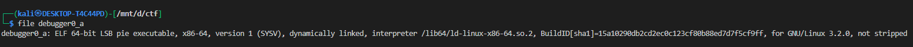
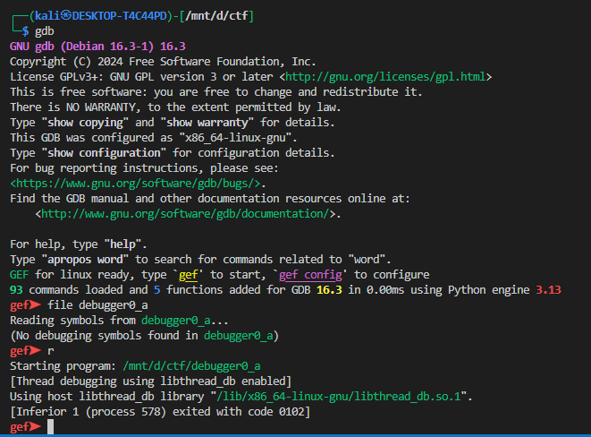
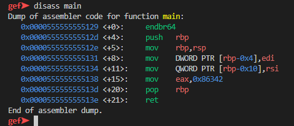
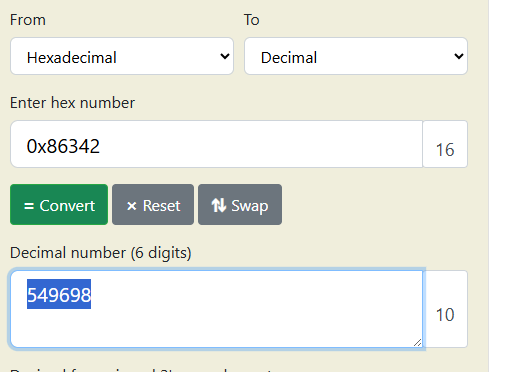

# **GDB baby step 1**

### Description

> Can you figure out what is in the eax register at the end of the main function? Put your answer in the picoCTF flag format: picoCTF{n} where n is the contents of the eax register in the decimal number base. If the answer was `0x11` your flag would be `picoCTF{17}`.

 

you can download gdb from [here](https://www.sourceware.org/gdb/) 

i will use [gef](https://github.com/hugsy/gef.git) a modern experience for GDB with advanced debugging capabilities for exploit devs & reverse engineers on Linux

it is not running so wee will statcally look 

here we can see that `0x86342` is pushed into eax 

so the flag is `picoCTF{549698}`