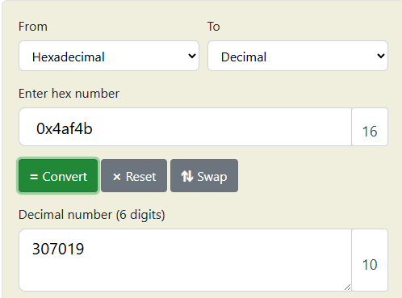

# **GDB baby step 2**


this challange is same as [GDB baby step 1](../7/)

### Description

> Can you figure out what is in the eax register at the end of the main function? Put your answer in the picoCTF flag format: picoCTF{n} where n is the contents of the eax register in the decimal number base. If the answer was `0x11` your flag would be `picoCTF{17}`.

 


you can download gdb from [here](https://www.sourceware.org/gdb/) 

i will use [gef](https://github.com/hugsy/gef.git) a modern experience for GDB with advanced debugging capabilities for exploit devs & reverse engineers on Linux


it is not running so wee will statcally look but that will take a while so we will disassemble the mian fun


we can find it stactically but it will take a while so we will do is run it and add a break point at 


```bash
0x0000000000401141 <+59>:    pop    rbp
```

```bash
break *0x401141
```

```bash
run
```


we can now see the value of rax which is `0x4af4b`




so the flag is `picoCTF{307019}`