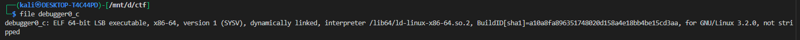
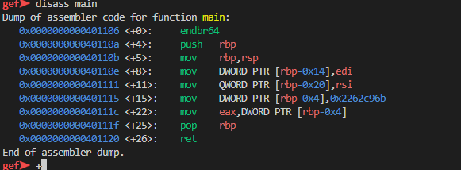
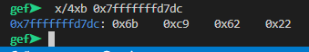

# **GDB baby step 3**


this challange is same as [GDB baby step 1](../7/) & [GDB baby step 2](../8/)

### Description

> Now for something a little different. 0x2262c96b is loaded into memory in the main function. Examine byte-wise the memory that the constant is loaded in by using the GDB command x/4xb addr. The flag is the four bytes as they are stored in memory. If you find the bytes 0x11 0x22 0x33 0x44 in the memory location, your flag would be: picoCTF{0x11223344}.

 


you can download gdb from [here](https://www.sourceware.org/gdb/) 

i will use [gef](https://github.com/hugsy/gef.git) a modern experience for GDB with advanced debugging capabilities for exploit devs & reverse engineers on Linux


we can do this challange with out gdb but we will use it as it is the requirement of the challange 




here we can see that 

```bash
mov    DWORD PTR [rbp-0x4],0x2262c96b
```

`0x2262c96b` is moved into `rbp-0x4`


we can get the address of rbp-0x4 uisng 


```bash
p/x $rbp-0x4
```

`p/x` means print in hexadecimal. This prints the address represented by $rbp-0x4.


now we can use  `x/4xb addr` to find the value

* **`x`** – stands for **examine memory**.
* **`/4`** – means examine **4 units**. Here, each unit’s size is determined by the next letter.
* **`b`** – stands for **byte**, so each unit is 1 byte.
* **`x/4xb addr`** – means: look at **4 bytes starting at `addr`**, and print each byte in **hexadecimal**.




so the flag would be `picoCTF{0x6bc96222}`