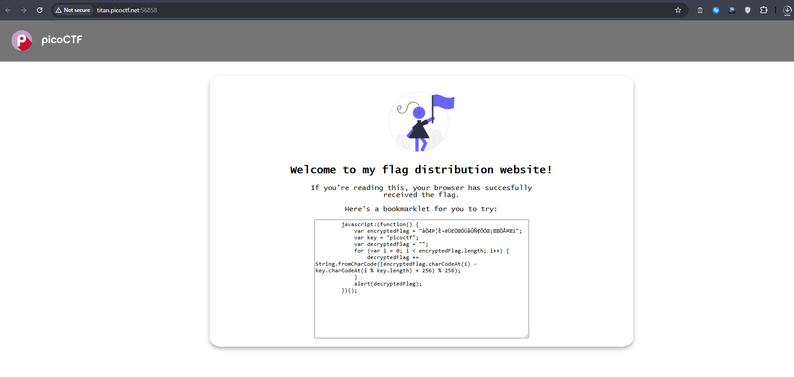
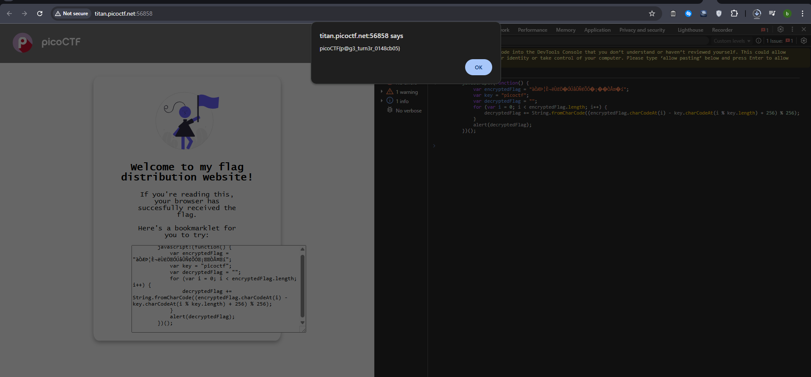

# IntroToBurp


## Description

> Why search for the flag when I can make a bookmarklet to print it for me?

## HINTS:

> A bookmarklet is a bookmark that runs JavaScript instead of loading a webpage.

> What happens when you click a bookmarklet?

> Web browsers have other ways to run JavaScript too




```js
javascript:(function() {
    var encryptedFlag = "àÒÆަȬë٣֖ÓÚåÛÑ¢ÕӖ¡›ÒŤ›í";
    var key = "picoctf";
    var decryptedFlag = "";
    for (var i = 0; i < encryptedFlag.length; i++) {
        decryptedFlag += String.fromCharCode((encryptedFlag.charCodeAt(i) - key.charCodeAt(i % key.length) + 256) % 256);
    }
    alert(decryptedFlag);
})();
```

we can run this code in the console to get the flag





> note that browsers donot allow to paste directly on the console it may give you warning to pass it you need to paste `allow pasting` first 
