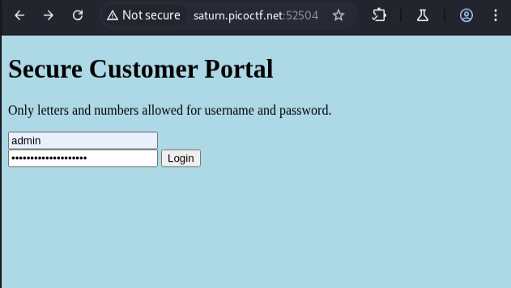
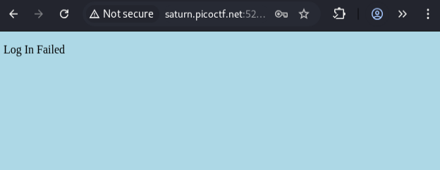
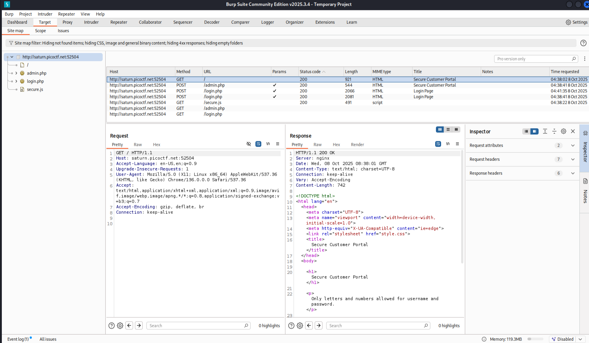
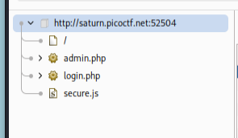
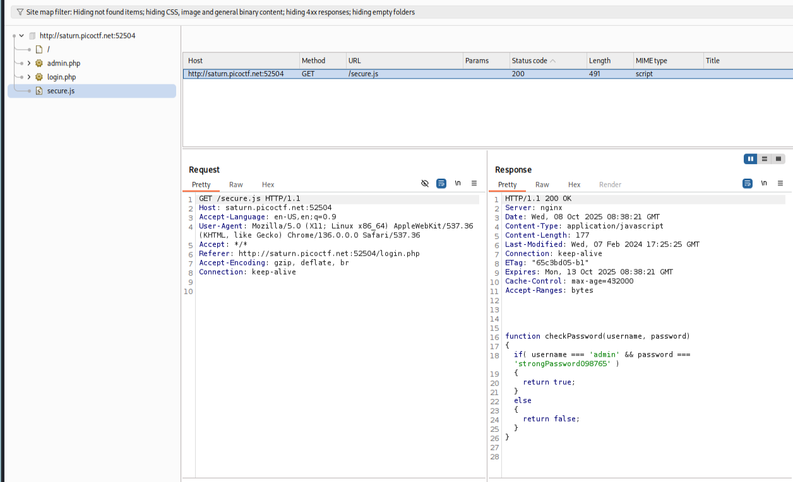
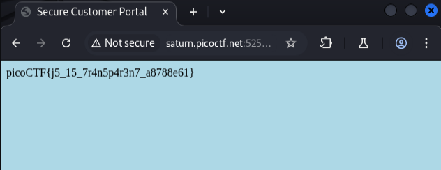

# Local Authority


## Description

> Can you get the flag?

## HINTS:

> How is the password checked on this website?







lets open this in the burpsuit 



here we can see the website file structure



here the `secure.js` is the file we want




```bash
HTTP/1.1 200 OK
Server: nginx
Date: Wed, 08 Oct 2025 08:38:21 GMT
Content-Type: application/javascript
Content-Length: 177
Last-Modified: Wed, 07 Feb 2024 17:25:25 GMT
Connection: keep-alive
ETag: "65c3bd05-b1"
Expires: Mon, 13 Oct 2025 08:38:21 GMT
Cache-Control: max-age=432000
Accept-Ranges: bytes

function checkPassword(username, password)
{
  if( username === 'admin' && password === 'strongPassword098765' )
  {
    return true;
  }
  else
  {
    return false;
  }
}
```

boom we got the credentials




This is a classic **client-side authentication** vulnerability (sometimes called *exposed secrets / insecure client-side logic*): the site performs the password check in JavaScript and actually ships the correct credentials (`admin:strongPassword098765`) to every visitor, so an attacker can simply read the JS (via View Source, Burp, or the browser console) and bypass authentication. To prevent this, **never perform authentication or store secrets in client-side code** — move all credential checking to the server, store only salted hashes of passwords (not plaintext), issue server-side session tokens on successful login, protect transport with HTTPS, and enforce protections such as rate limiting, account lockout, and proper input validation; treat client code as fully public (obfuscation is not a security control) and remove any hard-coded secrets or debug backdoors before deployment.
